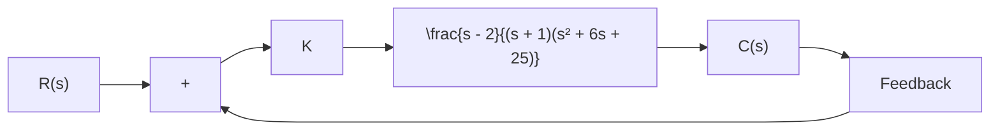

B–5–15. Using MATLAB, obtain the unit-step response curve for the unity-feedback control system whose openloop transfer function is

$$G (s) = \frac {1 0}{s (s + 2) (s + 4)}$$

Using MATLAB, obtain also the rise time, peak time, maximum overshoot, and settling time in the unit-step response curve.

B–5–16. Consider the closed-loop system defined by

$$\frac {C (s)}{R (s)} = \frac {2 \zeta s + 1}{s ^ {2} + 2 \zeta s + 1}$$

where $\zeta = 0 . 2 , 0 . 4 , 0 . 6 , 0 . 8 ,$ and 1.0. Using MATLAB, plot a two-dimensional diagram of unit-impulse response curves. Also plot a three-dimensional plot of the response curves.

B–5–17. Consider the second-order system defined by

$$\frac {C (s)}{R (s)} = \frac {s + 1}{s ^ {2} + 2 \zeta s + 1}$$

where $\zeta = 0 . 2 , 0 . 4 , 0 . 6 , 0 . 8 , 1 . 0$ . Plot a three-dimensional diagram of the unit-step response curves.

B–5–18. Obtain the unit-ramp response of the system defined by

$$
\left[ \begin{array}{c} \dot {x} _ {1} \\ \dot {x} _ {2} \end{array} \right] = \left[ \begin{array}{c c} 0 & 1 \\ - 1 & - 1 \end{array} \right] \left[ \begin{array}{c} x _ {1} \\ x _ {2} \end{array} \right] + \left[ \begin{array}{c} 0 \\ 1 \end{array} \right] u

y = \left[ \begin{array}{c c} 1 & 0 \end{array} \right] \left[ \begin{array}{c} x _ {1} \\ x _ {2} \end{array} \right]
$$

where u is the unit-ramp input. Use the lsim command to obtain the response.

B–5–19. Consider the differential equation system given by

$$\ddot {y} + 3 \dot {y} + 2 y = 0, \quad y (0) = 0. 1, \quad \dot {y} (0) = 0. 0 5$$

Using MATLAB, obtain the response y(t), subject to the given initial condition.

B–5–20. Determine the range of K for stability of a unityfeedback control system whose open-loop transfer function is

$$G (s) = \frac {K}{s (s + 1) (s + 2)}$$

B–5–21. Consider the following characteristic equation:

$$s ^ {4} + 2 s ^ {3} + (4 + K) s ^ {2} + 9 s + 2 5 = 0$$

Using the Routh stability criterion, determine the range of K for stability.

B–5–22. Consider the closed-loop system shown in Figure 5–79. Determine the range of K for stability. Assume that $K > 0$ .

flowchart

Figure 5–79 Closed-loop system.
