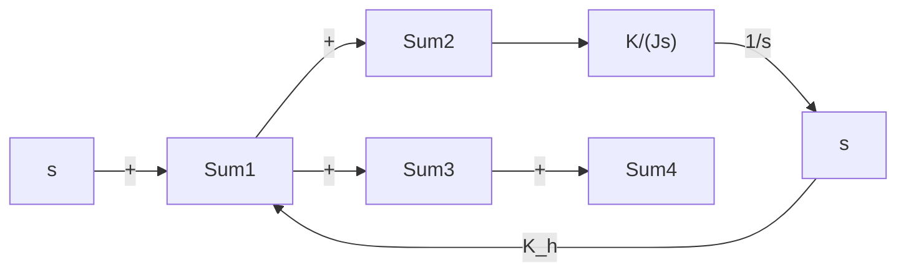

B–5–23. Consider the satellite attitude control system shown in Figure 5–80(a). The output of this system exhibits continued oscillations and is not desirable. This system can be stabilized by use of tachometer feedback, as shown in Figure 5–80(b). If $K / J = 4$ , what value of $K _ { h }$ will yield the damping ratio to be 0.6?


<details>
<summary>flowchart</summary>

```mermaid
graph LR
    R["s"] --> |+| Sum
    Sum --> K["K"]
    K --> |1/(Js²)| C["s"]
    C["s"] --> |feedback| Sum
```
</details>

(a)


<details>
<summary>flowchart</summary>


</details>

(b)   
Figure 5–80

(a) Unstable satellite attitude control system;

(b) stabilized system.

B–5–24. Consider the servo system with tachometer feedback shown in Figure 5–81. Determine the ranges of stability for K and $K _ { h }$ . (Note that $K _ { h }$ must be positive.)

B–5–25. Consider the system

$$\dot {\mathbf {x}} = \mathbf {A} \mathbf {x}$$

where matrix A is given by

$$
\mathbf {A} = \left[ \begin{array}{c c c} 0 & 1 & 0 \\ - b _ {3} & 0 & 1 \\ 0 & - b _ {2} & - b _ {1} \end{array} \right]
$$

(A is called Schwarz matrix.) Show that the first column of the Routh’s array of the characteristic equation $| s \mathbf { I } - \mathbf { A } | = 0$ consists of 1 $\lfloor , b _ { 1 } , b _ { 2 }$ , and $b _ { 1 } b _ { 3 }$ .

B–5–26. Consider a unity-feedback control system with the closed-loop transfer function

$$\frac {C (s)}{R (s)} = \frac {K s + b}{s ^ {2} + a s + b}$$

Determine the open-loop transfer function G(s).

Show that the steady-state error in the unit-ramp response is given by

$$e _ {\mathrm{ss}} = \frac {1}{K _ {v}} = \frac {a - K}{b}$$

B–5–27. Consider a unity-feedback control system whose open-loop transfer function is

$$G (s) = \frac {K}{s (J s + B)}$$

Discuss the effects that varying the values of K and B has on the steady-state error in unit-ramp response. Sketch typical unit-ramp response curves for a small value, medium value, and large value of K, assuming that B is constant.
