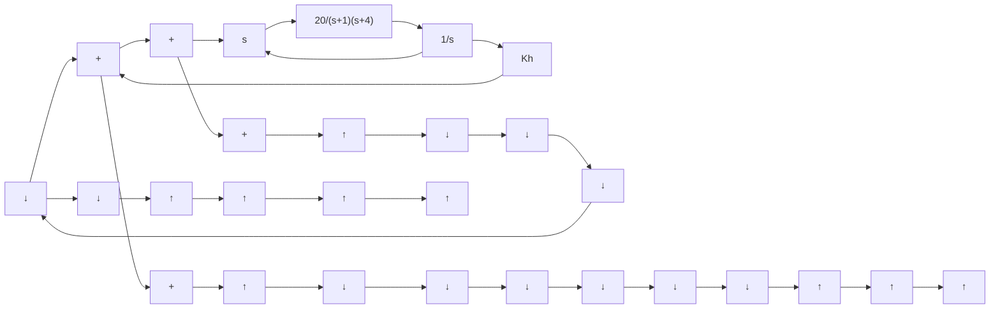

B–5–28. If the feedforward path of a control system contains at least one integrating element, then the output continues to change as long as an error is present. The output stops when the error is precisely zero. If an external disturbance enters the system, it is desirable to have an integrating element between the error-measuring element and the point where the disturbance enters, so that the effect of the external disturbance may be made zero at steady state.

Show that, if the disturbance is a ramp function, then the steady-state error due to this ramp disturbance may be eliminated only if two integrators precede the point where the disturbance enters.

flowchart

Figure 5–81 Servo system with tachometer feedback.

text_image

6

