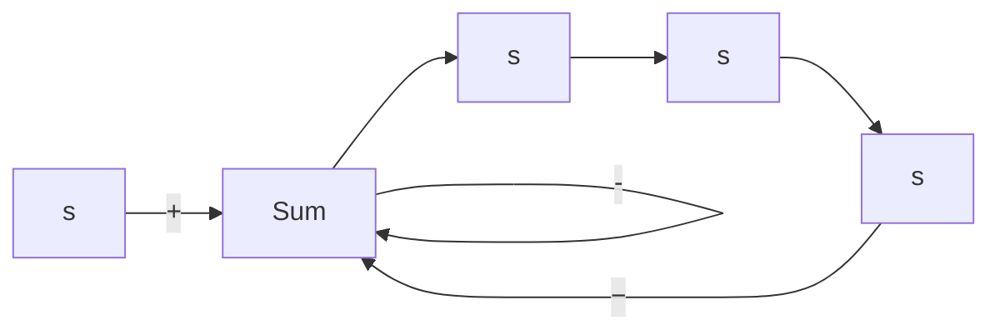

# 6–2 ROOT-LOCUS PLOTS

Angle and Magnitude Conditions. Consider the negative feedback system shown in Figure 6–1. The closed-loop transfer function is

$$\frac {C (s)}{R (s)} = \frac {G (s)}{1 + G (s) H (s)} \tag {6-1}$$

Figure 6–1 Control system.   

flowchart

The characteristic equation for this closed-loop system is obtained by setting the denominator of the right-hand side of Equation (6–1) equal to zero. That is,

$$1 + G (s) H (s) = 0$$

or

$$G (s) H (s) = - 1 \tag {6-2}$$

Here we assume that $G ( s ) H ( s )$ is a ratio of polynomials in s. [It is noted that we can extend the analysis to the case when $G ( s ) H ( s )$ involves the transport lag $e ^ { - T s } .$ .] Since $G ( s ) H ( s )$ is a complex quantity, Equation (6–2) can be split into two equations by equating the angles and magnitudes of both sides, respectively, to obtain the following:

Angle condition:

$$\underline {{G (s) H (s)}} = \pm 1 8 0 ^ {\circ} (2 k + 1) \quad (k = 0, 1, 2, \dots) \tag {6-3}$$

Magnitude condition:

$$| G (s) H (s) | = 1 \tag {6-4}$$

The values of s that fulfill both the angle and magnitude conditions are the roots of the characteristic equation, or the closed-loop poles. A locus of the points in the complex plane satisfying the angle condition alone is the root locus. The roots of the characteristic equation (the closed-loop poles) corresponding to a given value of the gain can be determined from the magnitude condition. The details of applying the angle and magnitude conditions to obtain the closed-loop poles are presented later in this section.

In many cases, $G ( s ) H ( s )$ involves a gain parameter K, and the characteristic equation may be written as

$$1 + \frac {K (s + z _ {1}) (s + z _ {2}) \cdots (s + z _ {m})}{(s + p _ {1}) (s + p _ {2}) \cdots (s + p _ {n})} = 0$$

Then the root loci for the system are the loci of the closed-loop poles as the gain K is varied from zero to infinity.

Note that to begin sketching the root loci of a system by the root-locus method we must know the location of the poles and zeros of $G ( s ) H ( s )$ . Remember that the angles of the complex quantities originating from the open-loop poles and open-loop zeros to the test point s are measured in the counterclockwise direction. For example, if $G ( s ) H ( s )$ is given by
