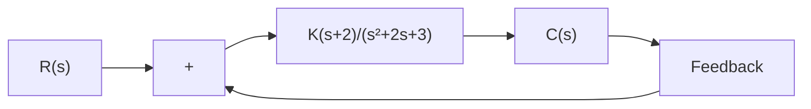

# EXAMPLE 6–2

In this example, we shall sketch the root-locus plot of a system with complex-conjugate openloop poles. Consider the negative feedback system shown in Figure 6–7. For this system,

$$G (s) = \frac {K (s + 2)}{s ^ {2} + 2 s + 3}, \quad H (s) = 1$$

where $K \geq 0$ . It is seen that $G ( s )$ has a pair of complex-conjugate poles at

$$s = - 1 + j \sqrt {2}, \quad s = - 1 - j \sqrt {2}$$

A typical procedure for sketching the root-locus plot is as follows:

1. Determine the root loci on the real axis. For any test point s on the real axis, the sum of the angular contributions of the complex-conjugate poles is 360°, as shown in Figure 6–8.Thus the net effect of the complex-conjugate poles is zero on the real axis.The location of the root locus on the real axis is determined from the open-loop zero on the negative real axis.A simple test reveals that a section of the negative real axis, that between –2 and $- \infty ,$ is a part of the root locus. It is noted that, since this locus lies between two zeros (at s=–2 and $s = - \infty )$ , it is actually a part of two root loci, each of which starts from one of the two complex-conjugate poles. In other words, two root loci break in the part of the negative real axis between –2 and –q.

Figure 6–7 Control system.   

flowchart

Figure 6–8

Determination of the root locus on the real axis.

text_image

jω
θ₁
-j√2
Test
point
-2
-1
0
σ
θ₂
-j√2

Since there are two open-loop poles and one zero, there is one asymptote, which coincides with the negative real axis.

2. Determine the angle of departure from the complex-conjugate open-loop poles. The presence of a pair of complex-conjugate open-loop poles requires the determination of the angle of departure from these poles. Knowledge of this angle is important, since the root locus near a complex pole yields information as to whether the locus originating from the complex pole migrates toward the real axis or extends toward the asymptote.
