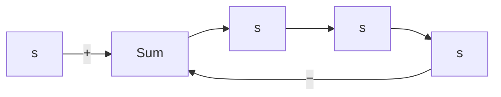

We shall now summarize the general rules and procedure for constructing the root loci of the negative feedback control system shown in Figure 6–11.

First, obtain the characteristic equation

$$1 + G (s) H (s) = 0$$

Then rearrange this equation so that the parameter of interest appears as the multiplying factor in the form

$$1 + \frac {K (s + z _ {1}) (s + z _ {2}) \cdots (s + z _ {m})}{(s + p _ {1}) (s + p _ {2}) \cdots (s + p _ {n})} = 0 \tag {6-11}$$

In the present discussions, we assume that the parameter of interest is the gain K, where $K > 0 .$ . (If $K < 0$ , which corresponds to the positive-feedback case, the angle condition must be modified. See Section 6–4.) Note, however, that the method is still applicable to systems with parameters of interest other than gain. (See Section 6–6.)

1. Locate the poles and zeros $o f G ( s ) H ( s )$ on the s plane.The root-locus branches start from open-loop poles and terminate at zeros (finite zeros or zeros at infinity). From the factored form of the open-loop transfer function, locate the open-loop poles and zeros in the s plane. CNote that the open-loop zeros are the zeros of $G ( s ) H ( s )$ , while the closed-loop zeros consist of the zeros of $G ( s )$ and the poles of $H ( s ) . ]$

flowchart

Figure 6–11 Control system.

Note that the root loci are symmetrical about the real axis of the s plane, because the complex poles and complex zeros occur only in conjugate pairs.

A root-locus plot will have just as many branches as there are roots of the characteristic equation. Since the number of open-loop poles generally exceeds that of zeros, the number of branches equals that of poles. If the number of closed-loop poles is the same as the number of open-loop poles, then the number of individual root-locus branches terminating at finite open-loop zeros is equal to the number m of the open-loop zeros. The remaining $n - m$ branches terminate at infinity $( n - m$ implicit zeros at infinity) along asymptotes.
