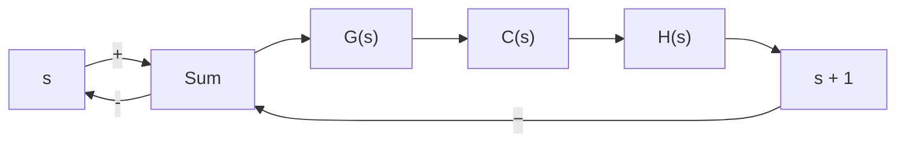
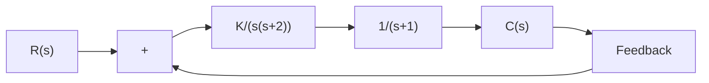

$$
\begin{array}{l} 1 + G (s) H (s) = 1 + \frac {K (s + 1)}{s (s + 1) (s + 2)} \\ = \frac {s (s + 2) + K}{s (s + 2)} \\ \end{array}
$$

The reduced characteristic equation is

$$s (s + 2) + K = 0$$

The root-locus plot of $G ( s ) H ( s )$ does not show all the roots of the characteristic equation, only the roots of the reduced equation.

To obtain the complete set of closed-loop poles, we must add the canceled pole of $G ( s ) H ( s )$ to those closed-loop poles obtained from the root-locus plot of $G ( s ) H ( s )$ . The important thing to remember is that the canceled pole of $G ( s ) H ( s )$ is a closed-loop pole of the system, as seen from Figure 6–14(c).


<details>
<summary>flowchart</summary>

```mermaid
graph LR
    R["s"] --> |+| Sum1["+"]
    Sum1 --> |+| Sum2["+"]
    Sum2 --> |K/(s+1)(s+2)| Transfer1["1/s"]
    Transfer1 --> C["s"]
    C --> |Feedback| Sum1
```
</details>

(a)

Figure 6–14 (a) Control system with velocity feedback; (b) and (c) modified block diagrams.   


<details>
<summary>flowchart</summary>


</details>

(b)


<details>
<summary>flowchart</summary>


</details>

(c)

Typical Pole–Zero Configurations and Corresponding Root Loci. In summarizing, we show several open-loop pole–zero configurations and their corresponding root loci in Table 6–1. The pattern of the root loci depends only on the relative separation of the open-loop poles and zeros. If the number of open-loop poles exceeds the number of finite zeros by three or more, there is a value of the gain K beyond which root loci enter the right-half s plane, and thus the system can become unstable. A stable system must have all its closed-loop poles in the left-half s plane.

Table 6–1 Open-Loop Pole–Zero Configurations and the Corresponding Root Loci
