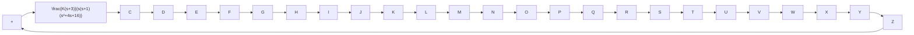

# EXAMPLE 6–3

Consider the system shown in Figure 6–15. Plot root loci with a square aspect ratio so that a line with slope 1 is a true $4 5 ^ { \circ }$ line. Choose the region of root-locus plot to be

$$- 6 \leq x \leq 6, \quad - 6 \leq y \leq 6$$

where x and y are the real-axis coordinate and imaginary-axis coordinate, respectively.

To set the given plot region on the screen to be square, enter the command

$$
v = \left[ \begin{array}{c c c c} - 6 & 6 & - 6 & 6 \end{array} \right]; \text { axis } (v); \text { axis } (^ {\prime} s q u a r e ^ {\prime})
$$

With this command, the region of the plot is as specified and a line with slope 1 is at a true $4 5 ^ { \circ }$ , not skewed by the irregular shape of the screen.

For this problem, the denominator is given as a product of first- and second-order terms. So we must multiply these terms to get a polynomial in s. The multiplication of these terms can be done easily by use of the convolution command, as shown next.

Define

$$a = s (s + 1): \quad a = [ 1 \quad 1 \quad 0 ]b = s ^ {2} + 4 s + 1 6: \quad b = [ 1 \quad 4 \quad 1 6 ]$$

Then we use the following command:

$$c = \operatorname{conv} (a, b)$$

Note that conv(a, b) gives the product of two polynomials a and b.See the following computer output:

$$
\begin{array}{c} \hline a = [ 1 \quad 1 \quad 0 ]; \\ b = [ 1 \quad 4 \quad 1 6 ]; \\ c = \text {conv} (a, b) \\ c = \\ \hline 1 \quad 5 \quad 2 0 \quad 1 6 \quad 0 \\ \hline \end{array}
$$

The denominator polynomial is thus found to be

$$\mathrm{den} = [ 1 \quad 5 \quad 2 0 \quad 1 6 \quad 0 ]$$

Figure 6–15 Control system.   

flowchart

To find the complex-conjugate open-loop poles (the roots of $s ^ { 2 } + 4 s + 1 6 = 0 )$ , we may enter the roots command as follows:

$$
\begin{array}{l} r = \text { roots } (b) \\ r = \\ - 2. 0 0 0 0 + 3. 4 6 4 \mathrm{li} \\ - 2. 0 0 0 0 - 3. 4 6 4 \mathrm{li} \\ \end{array}
$$

Thus, the system has the following open-loop zero and open-loop poles:

Open-loop zero: s=–3

Open-loop poles: s=0, s=–1, s=–2 ; j3.4641

MATLAB Program 6–1 will plot the root-locus diagram for this system. The plot is shown in Figure 6–16.
