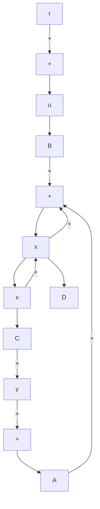

<details>
<summary>line</summary>

| Real Axis | Imag Axis |
| --- | --- |
| -4.0 | 4.0 |
| -3.0 | 3.0 |
| -2.0 | 2.0 |
| -1.0 | 1.0 |
| 0.0 | 0.0 |
| 1.0 | -1.0 |
| 2.0 | -2.0 |
| 3.0 | -3.0 |
| 4.0 | -4.0 |
</details>

Figure 6–18 Root-locus plot.

By a conventional trial-and-error approach or using the command rlocfind to be presented later in this section, we find the particular region of interest to be $2 0 \leq K \leq 3 0 .$ . By entering MATLAB Program 6–3, we obtain the root-locus plot shown in Figure 6–18. From this plot, it is clear that the two branches that approach in the upper half-plane (or in the lower half-plane) do not touch.

MATLAB Program 6–3   
```matlab
% ---- Root-locus plot ----
num = [1];
den = [1 1.1 10.3 5 0];
K1 = 0:0.2:20;
K2 = 20:0.1:30;
K3 = 30:5:1000;
K = [K1 K2 K3];
r = rlocus(num,den,K);
plot(r,'o')
v = [-4 4 -4 4]; axis(v)
grid
title('Root-Locus Plot of G(s) = K/[s(s + 0.5)(s^2 + 0.6s + 10)]')
xlabel('Real Axis')
ylabel('Imag Axis') 
```

EXAMPLE 6–5 Consider the system shown in Figure 6–19. The system equations are

$$\dot {\mathbf {x}} = \mathbf {A} \mathbf {x} + \mathbf {B} uy = \mathbf {C x} + D uu = r - y$$

Figure 6–19 Closed-loop control system.   


<details>
<summary>flowchart</summary>


</details>

In this example problem we shall obtain the root-locus diagram of the system defined in state space. As an example let us consider the case where matrices A, B, C, and D are

$$
\mathbf {A} = \left[ \begin{array}{c c c} 0 & 1 & 0 \\ 0 & 0 & 1 \\ - 1 6 0 & - 5 6 & - 1 4 \end{array} \right], \quad \mathbf {B} = \left[ \begin{array}{c} 0 \\ 1 \\ - 1 4 \end{array} \right] \tag {6-15}

\mathbf {C} = \left[ \begin{array}{c c c} 1 & 0 & 0 \end{array} \right], \qquad \qquad D = [ 0 ]
$$

The root-locus plot for this system can be obtained with MATLAB by use of the following command:

$$r l o c u s (A, B, C, D)$$

This command will produce the same root-locus plot as can be obtained by use of the rlocus (num,den) command, where num and den are obtained from

$$[ \mathrm{num}, \mathrm{den} ] = \mathrm{ss2tf} (\mathrm{A}, \mathrm{B}, \mathrm{C}, \mathrm{D})$$

as follows:

$$\text { num } = [ 0 0 1 0 ]\mathrm{den} = [ 1 1 4 5 6 1 6 0 ]$$
