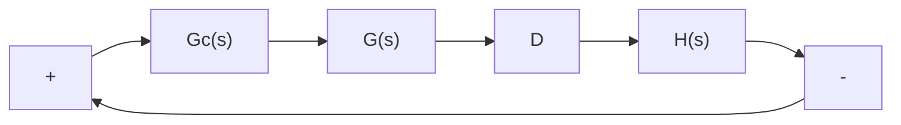
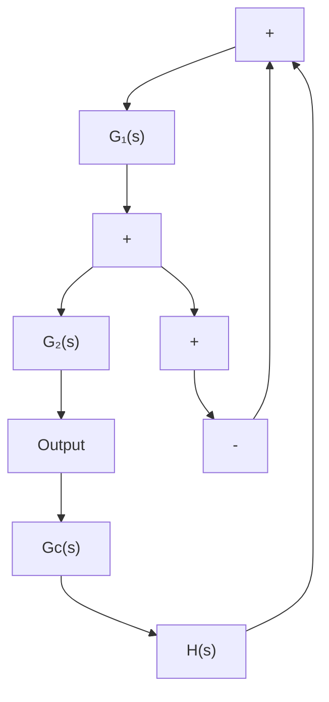

In general, series compensation may be simpler than parallel compensation; however, series compensation frequently requires additional amplifiers to increase the gain and/or to provide isolation. (To avoid power dissipation, the series compensator is inserted at the lowest energy point in the feedforward path.) Note that, in general, the number of components required in parallel compensation will be less than the number of components

Figure 6–33

(a) Series compensation; (b) parallel or feedback compensation.

flowchart

(a)

flowchart

(b)

in series compensation, provided a suitable signal is available, because the energy transfer is from a higher power level to a lower level. (This means that additional amplifiers may not be necessary.)

In Sections 6–6 through 6–9 we first discuss series compensation techniques and then present a parallel compensation technique using a design of a velocity-feedback control system.

Commonly Used Compensators. If a compensator is needed to meet the performance specifications, the designer must realize a physical device that has the prescribed transfer function of the compensator.

Numerous physical devices have been used for such purposes. In fact, many noble and useful ideas for physically constructing compensators may be found in the literature.
