$$K _ {c} \alpha = \frac {R _ {4} C _ {1}}{R _ {3} C _ {2}} \frac {R _ {2} C _ {2}}{R _ {1} C _ {1}} = \frac {R _ {2} R _ {4}}{R _ {1} R _ {3}}, \quad \alpha = \frac {R _ {2} C _ {2}}{R _ {1} C _ {1}}$$

This network has a dc gain of $K _ { c } \alpha = R _ { 2 } R _ { 4 } / ( R _ { 1 } R _ { 3 } )$ .

From Equation (6–18), we see that this network is a lead network if $R _ { 1 } C _ { 1 } > R _ { 2 } C _ { 2 }$ , or $\alpha < 1$ It is a lag network if. $R _ { 1 } C _ { 1 } < R _ { 2 } C _ { 2 }$ The pole-zero configurations of this net-. work when $R _ { 1 } C _ { 1 } > R _ { 2 } C _ { 2 }$ and $R _ { 1 } C _ { 1 } < R _ { 2 } C _ { 2 }$ are shown in Figure 6–37(a) and (b), respectively.

Lead Compensation Techniques Based on the Root-Locus Approach. The root-locus approach to design is very powerful when the specifications are given in terms of time-domain quantities, such as the damping ratio and undamped natural frequency of the desired dominant closed-loop poles, maximum overshoot, rise time, and settling time.

Consider a design problem in which the original system either is unstable for all values of gain or is stable but has undesirable transient-response characteristics. In such a case, the reshaping of the root locus is necessary in the broad neighborhood of the jv axis and the origin in order that the dominant closed-loop poles be at desired locations in the complex plane.This problem may be solved by inserting an appropriate lead compensator in cascade with the feedforward transfer function.

The procedures for designing a lead compensator for the system shown in Figure 6–38 by the root-locus method may be stated as follows:

1. From the performance specifications, determine the desired location for the dominant closed-loop poles.

Figure 6–38

Control system.

```mermaid
graph LR
    A["+"] --> B["Gc(s)"]
    B --> C["G(s)"]
    C --> D
    D --> E
    E --> F
    F --> G
    G --> H
    H --> I
    I --> J
    J --> K
    K --> L
    L --> M
    M --> N
    N --> O
    O --> P
    P --> Q
    Q --> R
    R --> S
    S --> T
    T --> U
    U --> V
    V --> W
    W --> X
    X --> Y
    Y --> Z
    Z --> A
```

flowchart

2. By drawing the root-locus plot of the uncompensated system (original system), ascertain whether or not the gain adjustment alone can yield the desired closedloop poles. If not, calculate the angle deficiency $\phi .$ This angle must be contributed by the lead compensator if the new root locus is to pass through the desired locations for the dominant closed-loop poles.
