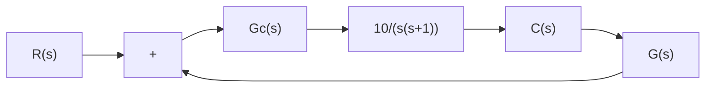

(a)

line

| σ | jω |
| --- | --- |
| -1 | -j3 |
| -1 | -j1 |
| -1 | -j2 |
| -1 | -j3 |
| -1 | -j1 |
| -1 | -j2 |
| -1 | -j3 |

(b)

The closed-loop poles are located at

$$s = - 0. 5 \pm j 3. 1 2 2 5$$

The damping ratio of the closed-loop poles is $\zeta = ( 1 / 2 ) / \sqrt { 1 0 } = 0 . 1 5 8 1$ .The undamped natural frequency of the closed-loop poles is $\omega _ { n } = \bigvee 1 0 = 3 . 1 6 2 3 \mathrm { r a d / s e c }$ . Because the damping ratio is small, this system will have a large overshoot in the step response and is not desirable.

It is desired to design a lead compensator $G _ { c } ( s )$ as shown in Figure 6–40(a) so that the dominant closed-loop poles have the damping ratio $\zeta = 0 . 5$ and the undamped natural frequency $\omega _ { n } = 3 \mathrm { r a d / s e c }$ The desired location of the dominant closed-loop poles can be determined from.

$$s ^ {2} + 2 \zeta \omega_ {n} s + \omega_ {n} ^ {2} = s ^ {2} + 3 s + 9= (s + 1. 5 + j 2. 5 9 8 1) (s + 1. 5 - j 2. 5 9 8 1)$$

as follows:

$$s = - 1. 5 \pm j 2. 5 9 8 1$$

flowchart

Figure 6–40   
(a) Compensated system; (b) desired closed-loop pole location.

(a)   

line

| σ | jω |
| --- | --- |
| -1.5 | j2.5981 |
| 0 | 0 |

[See Figure 6–40 (b).] In some cases, after the root loci of the original system have been obtained, the dominant closed-loop poles may be moved to the desired location by simple gain adjustment. This is, however, not the case for the present system. Therefore, we shall insert a lead compensator in the feedforward path.
