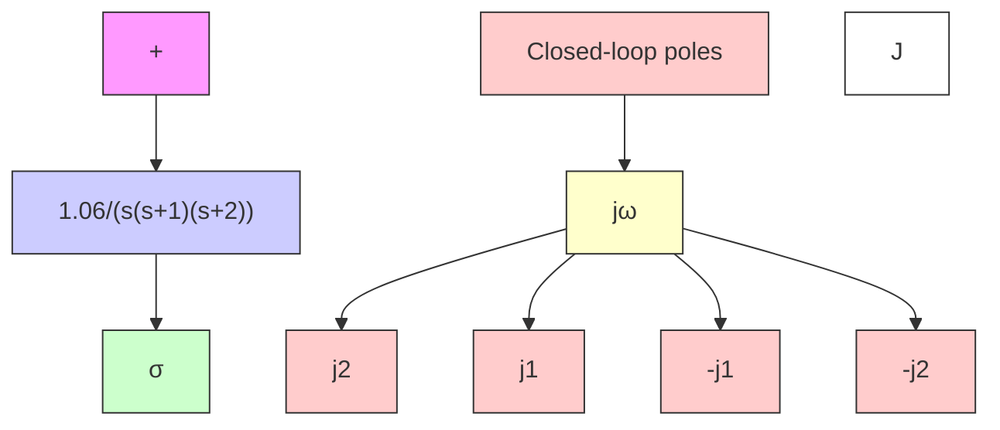

flowchart

Figure 6–47 Control system.

$$G (s) = \frac {1 . 0 6}{s (s + 1) (s + 2)}$$

The root-locus plot for the system is shown in Figure 6–48(b). The closed-loop transfer function becomes

$$
\begin{array}{l} \frac {C (s)}{R (s)} = \frac {1 . 0 6}{s (s + 1) (s + 2) + 1 . 0 6} \\ = \frac {1 . 0 6}{(s + 0 . 3 3 0 7 - j 0 . 5 8 6 4) (s + 0 . 3 3 0 7 + j 0 . 5 8 6 4) (s + 2 . 3 3 8 6)} \\ \end{array}
$$

The dominant closed-loop poles are

$$s = - 0. 3 3 0 7 \pm j 0. 5 8 6 4$$

The damping ratio of the dominant closed-loop poles is $\zeta = 0 . 4 9 1$ The undamped natural. frequency of the dominant closed-loop poles is 0.673 radsec.The static velocity error constant is 0.53 sec–1.

It is desired to increase the static velocity error constant $K _ { v }$ to about 5 sec–1 without appreciably changing the location of the dominant closed-loop poles.

To meet this specification, let us insert a lag compensator as given by Equation (6–19) in cascade with the given feedforward transfer function. To increase the static velocity error constant by a factor of about 10, let us choose $\beta = 1 0$ and place the zero and pole of the lag compensator at s=–0.05 and s=–0.005, respectively.The transfer function of the lag compensator becomes

$$G _ {c} (s) = \hat {K} _ {c} \frac {s + 0 . 0 5}{s + 0 . 0 0 5}$$

flowchart

Figure 6–48   
(a) Control system;   
(b) root-locus plot.

Figure 6–49   
Compensated system.   

flowchart

