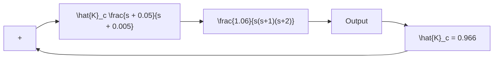

The angle contribution of this lag network near a dominant closed-loop pole is about 4°. Because this angle contribution is not very small, there is a small change in the new root locus near the desired dominant closed-loop poles.

The open-loop transfer function of the compensated system then becomes

$$G _ {c} (s) G (s) = \hat {K} _ {c} \frac {s + 0 . 0 5}{s + 0 . 0 0 5} \frac {1 . 0 6}{s (s + 1) (s + 2)}= \frac {K (s + 0 . 0 5)}{s (s + 0 . 0 0 5) (s + 1) (s + 2)}$$

where

$$K = 1. 0 6 \hat {K} _ {c}$$

The block diagram of the compensated system is shown in Figure 6–49.The root-locus plot for the compensated system near the dominant closed-loop poles is shown in Figure 6–50(a), together with the original root-locus plot. Figure 6–50(b) shows the root-locus plot of the compensated system near the origin.The MATLAB program to generate the root-locus plots shown in Figures 6–50(a) and (b) is given in MATLAB Program 6–11.

Root-Locus Plots of Compensated and Uncompensated Systems   

line

| System Type | Real Axis | Imag Axis |
| --- | --- | --- |
| Uncompensated system | -0.5 | 1.0 |
| Original closed-loop pole | -0.5 | 0.5 |
| New closed-loop pole | 0.0 | 0.0 |
| Compensated system | -2.0 | 0.0 |

(a)

Root-Locus Plot of Compensated System near the Origin   

scatter

| Real Axis | Imag Axis |
| --- | --- |
| -0.4 | 0.5 |
| -0.2 | 0.0 |
| 0.0 | 0.0 |
| 0.0 | -0.1 |
| 0.0 | -0.2 |
| 0.0 | -0.3 |
| 0.0 | -0.4 |
| 0.0 | -0.5 |

Figure 6–50   
(a) Root-locus plots of the compensated system and uncompensated system; (b) root-locus plot of compensated system near the origin.

MATLAB Program 6–11   
% **** Root-locus plots of the compensated system and
% uncompensated system ****

% **** Enter the numerators and denominators of the
% compensated and uncompensated systems ****

numc = [1 0.05];
denc = [1 3.005 2.015 0.01 0];
num = [1.06];
den = [1 3 2 0];

% **** Enter rlocus command. Plot the root loci of both
% systems ****

rlocus(numc,denc)
hold

Current plot held

rlocus(num,den)

v = [-3 1 -2 2]; axis(v); axis('square')

grid

text(-2.8,0.2,'Compensated system')
