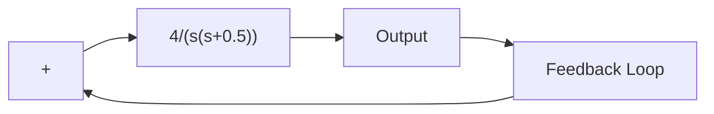

It is desired to make the damping ratio of the dominant closed-loop poles equal to 0.5 and to increase the undamped natural frequency to 5 radsec and the static velocity error constant to 80 sec–1. Design an appropriate compensator to meet all the performance specifications.

Let us assume that we use a lag–lead compensator having the transfer function

$$G _ {c} (s) = K _ {c} \left(\frac {s + \frac {1}{T _ {1}}}{s + \frac {\gamma}{T _ {1}}}\right) \left(\frac {s + \frac {1}{T _ {2}}}{s + \frac {1}{\beta T _ {2}}}\right) \quad (\gamma > 1, \beta > 1)$$

where g is not equal to b.Then the compensated system will have the open-loop transfer function

$$G _ {c} (s) G (s) = K _ {c} \left(\frac {s + \frac {1}{T _ {1}}}{s + \frac {\gamma}{T _ {1}}}\right) \left(\frac {s + \frac {1}{T _ {2}}}{s + \frac {1}{\beta T _ {2}}}\right) G (s)$$

From the performance specifications, the dominant closed-loop poles must be at

$$s = - 2. 5 0 \pm j 4. 3 3$$

Since

$$\left. \frac {4}{s (s + 0 . 5)} \right| _ {s = - 2. 5 0 + j 4. 3 3} = - 2 3 5 ^ {\circ}$$

the phase-lead portion of the lag–lead compensator must contribute $5 5 ^ { \circ }$ so that the root locus passes through the desired location of the dominant closed-loop poles.

To design the phase-lead portion of the compensator, we first determine the location of the zero and pole that will give $5 5 ^ { \circ }$ contribution. There are many possible choices, but we shall here choose the zero at $s = - 0 . 5$ so that this zero will cancel the pole at $s = - 0 . 5$ of the plant. Once the zero is chosen, the pole can be located such that the angle contribution is $5 5 ^ { \circ }$ . By simple calculation or graphical analysis, the pole must be located at $s = - 5 . 0 2$ . Thus, the phase-lead portion of the lag–lead compensator becomes

$$K _ {c} \frac {s + \frac {1}{T _ {1}}}{s + \frac {\gamma}{T _ {1}}} = K _ {c} \frac {s + 0 . 5}{s + 5 . 0 2}$$

Figure 6–55 Control system.   

flowchart

Thus

$$T _ {1} = 2, \quad \gamma = \frac {5 . 0 2}{0 . 5} = 1 0. 0 4$$

Next we determine the value of $K _ { c }$ from the magnitude condition:

$$\left| K _ {c} \frac {s + 0 . 5}{s + 5 . 0 2} \frac {4}{s (s + 0 . 5)} \right| _ {s = - 2. 5 + j 4. 3 3} = 1$$

Hence,

$$K _ {c} = \left| \frac {(s + 5 . 0 2) s}{4} \right| _ {s = - 2. 5 + j 4. 3 3} = 6. 2 6$$
