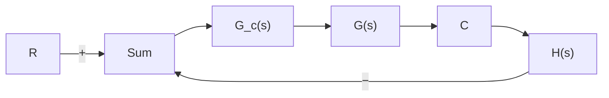

# 6–9 PARALLEL COMPENSATION

Thus far we have presented series compensation techniques using lead, lag, or lag–lead compensators. In this section we discuss parallel compensation technique. Because in the parallel compensation design the controller (or compensator) is in a minor loop, the design may seem to be more complicated than in the series compensation case. It is, however, not complicated if we rewrite the characteristic equation to be of the same form as the characteristic equation for the series compensated system. In this section we present a simple design problem involving parallel compensation.

Basic Principle for Designing Parallel Compensated System. Referring to Figure 6–60(a), the closed-loop transfer function for the system with series compensation is

$$\frac {C}{R} = \frac {G _ {c} G}{1 + G _ {c} G H}$$

The characteristic equation is

$$1 + G _ {c} G H = 0$$

Given G and H, the design problem becomes that of determining the compensator $G _ { c }$ that satisfies the given specification.


<details>
<summary>flowchart</summary>


</details>

(a)


<details>
<summary>flowchart</summary>

```mermaid
graph LR
    R --> |+| Sum1
    Sum1 --> G1["G₁(s)"]
    G1 --> |+| Sum2
    Sum2 --> G2["G₂(s)"]
    G2 --> C
    C --> |Gc(s)| Sum1
    C --> |H(s)| Sum1
    Sum1 --> |+| Sum2
```
</details>

(b)   
Figure 6–60 (a) Series compensation; (b) parallel or feedback compensation.

The closed-loop transfer function for the system with parallel compensation [Figure 6–60(b)] is

$$\frac {C}{R} = \frac {G _ {1} G _ {2}}{1 + G _ {2} G _ {c} + G _ {1} G _ {2} H}$$

The characteristic equation is

$$1 + G _ {1} G _ {2} H + G _ {2} G _ {c} = 0$$

By dividing this characteristic equation by the sum of the terms that do not involve $G _ { c }$ , we obtain

$$1 + \frac {G _ {c} G _ {2}}{1 + G _ {1} G _ {2} H} = 0 \tag {6-25}$$

If we define

$$G _ {f} = \frac {G _ {2}}{1 + G _ {1} G _ {2} H}$$

then Equation (6–25) becomes

$$1 + G _ {c} G _ {f} = 0$$

Since $G _ { f }$ is a fixed transfer function, the design of $G _ { c }$ becomes the same as the case of series compensation. Hence the same design approach applies to the parallel compensated system.
