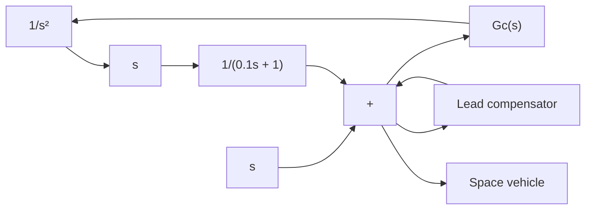

$$b _ {2} \left[ s X _ {i} (s) - s X _ {o} (s) \right] + k _ {2} \left[ X _ {i} (s) - X _ {o} (s) \right] = b _ {1} \left[ s X _ {o} (s) - s Y (s) \right]b _ {1} \left[ s X _ {o} (s) - s Y (s) \right] = k _ {1} Y (s)$$

If we eliminate $Y ( s )$ from the last two equations, the transfer function $X _ { o } ( s ) / X _ { i } ( s )$ can be obtained as

$$\frac {X _ {o} (s)}{X _ {i} (s)} = \frac {\left(\frac {b _ {1}}{k _ {1}} s + 1\right) \left(\frac {b _ {2}}{k _ {2}} s + 1\right)}{\left(\frac {b _ {1}}{k _ {1}} s + 1\right) \left(\frac {b _ {2}}{k _ {2}} s + 1\right) + \frac {b _ {1}}{k _ {2}} s}$$

Define

$$T _ {1} = \frac {b _ {1}}{k _ {1}}, \quad T _ {2} = \frac {b _ {2}}{k _ {2}},$$

If $k _ { 1 } , k _ { 2 } , b _ { 1 }$ , and $b _ { 2 }$ are chosen such that there exists a $\beta$ that satisfies the following equation:

$$\frac {b _ {1}}{k _ {1}} + \frac {b _ {2}}{k _ {2}} + \frac {b _ {1}}{k _ {2}} = \frac {T _ {1}}{\beta} + \beta T _ {2} \quad (\beta > 1) \tag {6-30}$$

then $X _ { o } ( s ) / X _ { i } ( s )$ can be obtained as

$$\frac {X _ {o} (s)}{X _ {i} (s)} = \frac {(T _ {1} s + 1) (T _ {2} s + 1)}{\left(\frac {T _ {1}}{\beta} s + 1\right) (\beta T _ {2} s + 1)} = \frac {\left(s + \frac {1}{T _ {1}}\right) \left(s + \frac {1}{T _ {2}}\right)}{\left(s + \frac {\beta}{T _ {1}}\right) \left(s + \frac {1}{\beta T _ {2}}\right)}$$

[Note that depending on the choice of $k _ { 1 } , k _ { 2 } , b _ { 1 }$ , and $b _ { 2 } ,$ , there does not exist a $\beta$ that satisfies Equation (6–30).]

If such a $\beta$ exists and if for a given $s _ { 1 }$ (where $s = s _ { 1 }$ is one of the dominant closed-loop poles of the control system to which we wish to use this mechanical device) the following conditions are satisfied:

$$\left| \frac {s _ {1} + \frac {1}{T _ {2}}}{s _ {1} + \frac {1}{\beta T _ {2}}} \right| \doteq 1, \quad - 5 ^ {\circ} < \left\lfloor \frac {s _ {1} + \frac {1}{T _ {2}}}{s _ {1} + \frac {1}{\beta T _ {2}}} < 0 ^ {\circ} \right.$$

then the mechanical system shown in Figure 6–75 acts as a lag–lead compensator.

flowchart

Figure 6–76 Space-vehicle control system.

A–6–13. Consider the model for a space-vehicle control system shown in Figure 6–76. Design a lead compensator $G _ { c } ( s )$ such that the damping ratio z and the undamped natural frequency $\omega _ { n }$ of the dominant closed-loop poles are 0.5 and 2 radsec, respectively.
