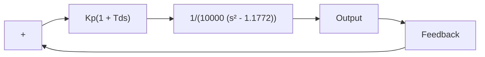

Figures 6–82(a) and (b) show the unit-step response and unit-ramp response of the compensated system.The unit-step response curve is reasonable and the unit-ramp response looks acceptable. Notice that in the unit-ramp response the output leads the input by a small amount.This is because the system has a feedback transfer function $1 / ( 0 . 1 s + 1 )$ ). If the feedback signal versus t is plotted, together with the unit-ramp input, the former will not lead the input ramp at steady state. See Figure 6–82(c).

Figure 6–82 (a) unit-step response of the compensated system; (b) unit-ramp response of the compensated system; (c) a plot of feedback signal versus t in the unit-ramp response.   

line

| t Sec | Output |
| --- | --- |
| 0 | 0.0 |
| 1 | 1.3 |
| 2 | 1.0 |
| 3 | 0.95 |
| 4 | 1.0 |
| 5 | 1.0 |
| 6 | 1.0 |
| 7 | 1.0 |
| 8 | 1.0 |
| 9 | 1.0 |
| 10 | 1.0 |

line

| t Sec | Unit-Ramp Input and Output |
| --- | --- |
| 0 | 0 |
| 1 | 1 |
| 2 | 2 |
| 3 | 3 |
| 4 | 4 |
| 5 | 5 |

(b)

line

| t Sec | Unit-Ramp Input and Feedback Signal |
| --- | --- |
| 0 | 0 |
| 1 | 1 |
| 2 | 2 |
| 3 | 3 |
| 4 | 4 |
| 5 | 5 |

(c)

A–6–14. Consider a system with an unstable plant as shown in Figure 6–83(a). Using the root-locus approach, design a proportional-plus-derivative controller that is, determine the values ofA $K _ { p }$ and $T _ { d } )$ such that the damping ratio $\zeta$ of the closed-loop system is 0.7 and the undamped natural frequency $\omega _ { n }$ is 0.5 radsec.

Solution. Note that the open-loop transfer function involves two poles at s=1.085 and $s = - 1 . 0 8 5$ and one zero at $s = - 1 / T _ { d }$ which is unknown at this point.,

Since the desired closed-loop poles must have $\omega _ { n } = 0 . 5$ radsec and $\zeta = 0 . 7$ , they must be located at

$$s = 0. 5 / 1 8 0 ^ {\circ} \pm 4 5. 5 7 3 ^ {\circ}$$

flowchart

