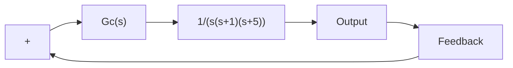

Root-Locus Plot of Compensated System near the Origin   

scatter

| Real Axis | Imag Axis | Type |
| --- | --- | --- |
| -1.5 | 3.5 | Desired closed-loop poles |
| -1.5 | -4.0 | Desired closed-loop poles |
| -7.0 | 0.0 | X |
| -7.0 | 0.0 | X |
| 0.0 | 0.0 | X |
| 0.0 | 0.0 | X |

Figure 6–88 (a) Root-locus plot of compensated system; (b) root-locus plot near the origin.

Unit-Step Responses of Compensated and Uncompensated Systems   

line

| t Sec | Compensated system | Uncompensated system |
| --- | --- | --- |
| 0 | 0.0 | 0.0 |
| 1 | 1.25 | 0.2 |
| 2 | 1.0 | 0.6 |
| 3 | 1.0 | 0.8 |
| 4 | 1.0 | 1.0 |
| 5 | 1.0 | 1.0 |
| 6 | 1.0 | 1.0 |
| 7 | 1.0 | 1.0 |
| 8 | 1.0 | 1.0 |
| 9 | 1.0 | 1.0 |
| 10 | 1.0 | 1.0 |

line

| t Sec | Compensated system | Uncompensated system |
| --- | --- | --- |
| 0 | 0 | 0 |
| 1 | ~1 | ~0.5 |
| 2 | ~2 | ~1 |
| 3 | ~3 | ~1.5 |
| 4 | ~4 | ~2 |
| 5 | ~5 | ~2.5 |
| 6 | ~6 | ~3 |
| 7 | ~7 | ~3.5 |
| 8 | ~8 | ~4 |
| 9 | ~9 | ~4.5 |
| 10 | 10 | ~5 |

(b)   
Figure 6–89   
(a) Unit-step responses of compensated and uncompensated systems; (b) unitramp responses of both systems.

To verify the improved system performance of the compensated system, see the unit-step responses and unit-ramp responses of the compensated and uncompensated systems shown in Figures 6–89 (a) and (b), respectively.

A–6–17. Consider the system shown in Figure 6–90. Design a lag–lead compensator such that the static velocity error constant $K _ { v }$ is 50 $\sec ^ { - 1 }$ and the damping ratio $\zeta$ of the dominant closedloop poles is 0.5. (Choose the zero of the lead portion of the lag–lead compensator to cancel the pole at $s = - 1$ of the plant.) Determine all closed-loop poles of the compensated system.

Figure 6–90 Control system.   

flowchart

Solution. Let us employ the lag–lead compensator given by
