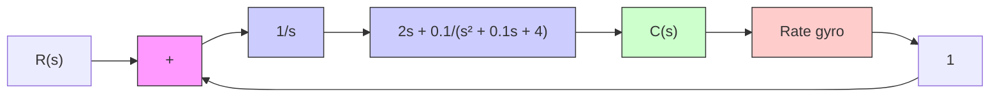

| t Sec | Output |
| --- | --- |
| 0 | 0 |
| 1 | 1 |
| 2 | 2 |
| 3 | 3 |
| 4 | 4 |
| 5 | 5 |
| 6 | 6 |
| 7 | 7 |
| 8 | 8 |
| 9 | 9 |
| 10 | 10 |

(b)   
Figure 6–92   
(a) Unit-step response of the compensated system; (b) unit-ramp response of the compensated system.

A–6–18. Figure 6–93(a) is a block diagram of a model for an attitude-rate control system.The closed-loop transfer function for this system is

$$
\begin{array}{l} \frac {C (s)}{R (s)} = \frac {2 s + 0 . 1}{s ^ {3} + 0 . 1 s ^ {2} + 6 s + 0 . 1} \\ = \frac {2 (s + 0 . 0 5)}{(s + 0 . 0 4 1 7 + j 2 . 4 4 8 9) (s + 0 . 0 4 1 7 - j 2 . 4 4 8 9) (s + 0 . 0 1 6 7)} \\ \end{array}
$$

The unit-step response of this system is shown in Figure 6–93(b). The response shows highfrequency oscillations at the beginning of the response due to the poles at $s = - 0 . 0 4 1 7 \pm j 2 . 4 4 8 9$ . The response is dominated by the pole at $s = - 0 . 0 1 6 7$ The settling time is approximately 240 sec..

flowchart

(a)

line

| Time (sec) | Amplitude |
| --- | --- |
| 0 | 0.65 |
| 10 | 0.60 |
| 20 | 0.55 |
| 30 | 0.50 |
| 40 | 0.45 |
| 50 | 0.40 |
| 60 | 0.35 |
| 70 | 0.30 |
| 80 | 0.25 |
| 90 | 0.20 |
| 100 | 0.15 |
| 110 | 0.10 |
| 120 | 0.05 |
| 130 | 0.00 |
| 140 | 0.05 |
| 150 | 0.10 |
| 160 | 0.15 |
| 170 | 0.20 |
| 180 | 0.25 |
| 190 | 0.30 |
| 200 | 0.35 |
| 210 | 0.40 |
| 220 | 0.45 |
| 230 | 0.50 |
| 240 | 0.55 |
| 250 | 0.60 |
| 260 | 0.65 |
| 270 | 0.70 |
| 280 | 0.75 |
| 290 | 0.80 |
| 300 | 0.85 |

(b)   
Figure 6–93   
(a) Attitude-rate control system;   
(b) unit-step response.

It is desired to speed up the response and also eliminate the oscillatory mode at the beginning of the response. Design a suitable compensator such that the dominant closed-loop poles are at $s = - 2 \pm j 2 { \sqrt { 3 } }$ .
