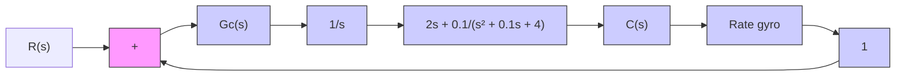

Solution. Figure 6–94 shows a block diagram for the compensated system. Note that the open-loop zero at $s = - 0 . 0 5$ and the open-loop pole at $s = 0$ generate a closed-loop pole between $s = 0$ and $s = - 0 . 0 5$ . Such a closed-loop pole becomes a dominant closed-loop pole and makes the response quite slow. Hence, it is necessary to replace this zero by a zero that is located far away from the jv axis—for example, a zero at s = -4.

Figure 6–94

Compensated attitude-rate control system.

flowchart

We now choose the compensator in the following form:

$$G _ {c} (s) = \hat {G} _ {c} (s) \frac {s + 4}{2 s + 0 . 1}$$

Then the open-loop transfer function of the compensated system becomes

$$
\begin{array}{l} G _ {c} (s) G (s) = \hat {G} _ {c} (s) \frac {s + 4}{2 s + 0 . 1} \frac {1}{s} \frac {2 s + 0 . 1}{s ^ {2} + 0 . 1 s + 4} \\ = \hat {G} _ {c} (s) \frac {s + 4}{s \left(s ^ {2} + 0 . 1 s + 4\right)} \\ \end{array}
$$

To determine $\hat { G } _ { c } ( s )$ by the root-locus method, we need to find the angle deficiency at the desired closed-loop pole $s = - 2 + j 2 { \sqrt { 3 } }$ The angle deficiency can be found as follows:.

$$
\begin{array}{l} \text { Angle   deficiency } = - 1 4 3. 0 8 8 ^ {\circ} - 1 2 0 ^ {\circ} - 1 0 9. 6 4 2 ^ {\circ} + 6 0 ^ {\circ} + 1 8 0 ^ {\circ} \\ = - 1 3 2. 7 3 ^ {\circ} \\ \end{array}
$$

Hence, the lead compensator $\hat { G } _ { c } ( s )$ must provide 132.73°. Since the angle deficiency is –132.73°, we need two lead compensators, each providing 66.365°.Thus $\hat { G } _ { c } ( s )$ will have the following form:

$$\hat {G} _ {c} (s) = K _ {c} \bigg (\frac {s + s _ {z}}{s + s _ {p}} \bigg) ^ {2}$$

Suppose that we choose two zeros at $s = - 2 ,$ . Then the two poles of the lead compensators can be obtained from

$$\frac {3 . 4 6 4 1}{s _ {p} - 2} = \tan (9 0 ^ {\circ} - 6 6. 3 6 5 ^ {\circ}) = 0. 4 3 7 6 1 6 9$$

or

$$
\begin{array}{l} s _ {p} = 2 + \frac {3 . 4 6 4 1}{0 . 4 3 7 6 1 6 9} \\ = 9. 9 1 5 8 \\ \end{array}
$$

(See Figure 6–95.) Hence,

$$\hat {G} _ {c} (s) = K _ {c} \left(\frac {s + 2}{s + 9 . 9 1 5 8}\right) ^ {2}$$
