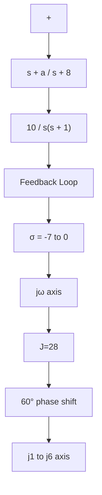

A–6–19. Consider the system shown in Figure 6–98(a). Determine the value of a such that the damping ratio z of the dominant closed poles is 0.5.

Solution. The characteristic equation is

$$1 + \frac {1 0 (s + a)}{s (s + 1) (s + 8)} = 0$$

The variable a is not a multiplying factor. Hence, we need to modify the characteristic equation. Since the characteristic equation can be written as

$$s ^ {3} + 9 s ^ {2} + 1 8 s + 1 0 a = 0$$

we rewrite this equation such that a appears as a multiplying factor as follows:

$$1 + \frac {1 0 a}{s (s ^ {2} + 9 s + 1 8)} = 0$$

Define

$$1 0 a = K$$

Then the characteristic equation becomes

$$1 + \frac {K}{s (s ^ {2} + 9 s + 1 8)} = 0$$

Notice that the characteristic equation is in a suitable form for the construction of the root loci.

flowchart

Figure 6–98   
(a) Control system; (b) root-locus plot, where K=10a.

This system involves three poles and no zero.The three poles are at $s = 0 , s = - 3$ , and s=–6. A root-locus branch exists on the real axis between points s=0 and s=–3. Also, another branch exists between points $s = - 6$ and $s = - \infty$ .

The asymptotes for the root loci are found as follows:

$$\text { Angles of asymptotes } = \frac {\pm 1 8 0 ^ {\circ} (2 k + 1)}{3} = 6 0 ^ {\circ}, - 6 0 ^ {\circ}, 1 8 0 ^ {\circ}$$

The intersection of the asymptotes and the real axis is obtained from

$$s = - \frac {0 + 3 + 6}{3} = - 3$$

The breakaway and break-in points can be determined from $d K / d s = 0$ where,

$$K = - \left(s ^ {3} + 9 s ^ {2} + 1 8 s\right)$$

Now we set

$$\frac {d K}{d s} = - (3 s ^ {2} + 1 8 s + 1 8) = 0$$

which yields

$$s ^ {2} + 6 s + 6 = 0$$

or

$$s = - 1. 2 6 8, \quad s = - 4. 7 3 2$$

Point s=–1.268 is on a root-locus branch.Hence,point s=–1.268 is an actual breakaway point.But point $s = - 4 . 7 3 2$ is not on the root locus and therefore is neither a breakaway nor break-in point.

Next we shall find points where root-locus branches cross the imaginary axis. We substitute $s = j \omega$ in the characteristic equation, which is

$$s ^ {3} + 9 s ^ {2} + 1 8 s + K = 0$$

as follows:

$$(j \omega) ^ {3} + 9 (j \omega) ^ {2} + 1 8 (j \omega) + K = 0$$

or

$$\left(K - 9 \omega^ {2}\right) + j \omega (1 8 - \omega^ {2}) = 0$$

from which we get
