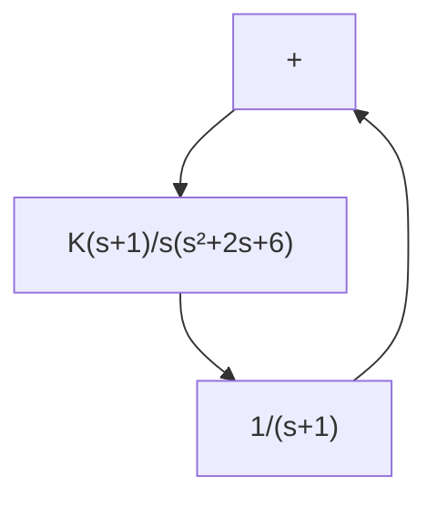
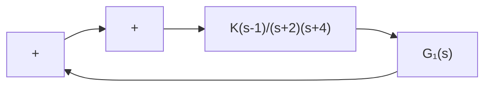
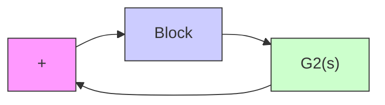

Sketch the constant-gain loci for K=1, 2, 5, 10, and 20 on the s plane.

B–6–11. Consider the system shown in Figure 6–101. Plot the root loci with MATLAB. Locate the closed-loop poles when the gain K is set equal to 2.

flowchart

Figure 6–101   
Control system.

B–6–12. Plot root-locus diagrams for the nonminimum-phase systems shown in Figures 6–102(a) and (b), respectively.

flowchart

(a)

flowchart

(b)   
Figure 6–102 (a) and (b) Nonminimum-phase systems.

B–6–13. Consider the mechanical system shown in Figure 6–103. It consists of a spring and two dashpots. Obtain the transfer function of the system. The displacement $x _ { i }$ is the input and displacement $x _ { o }$ is the output. Is this system a mechanical lead network or lag network?

text_image

b₂
k
b₁
xᵢ
xₒ
n.

Figure 6–103 Mechanical system

B–6–14. Consider the system shown in Figure 6–104. Plot the root loci for the system. Determine the value of K such that the damping ratio $\zeta$ of the dominant closed-loop poles is 0.5. Then determine all closed-loop poles. Plot the unitstep response curve with MATLAB.

```mermaid
graph LR
    A["+"] --> B["\frac{K}{s(s² + 4s + 5)}"]
    B --> C
    C --> D
    D --> E
    E --> F
    F --> G
    G --> H
    H --> I
    I --> J
    J --> K
    K --> L
    L --> M
    M --> N
    N --> O
    O --> P
    P --> Q
    Q --> R
    R --> S
    S --> T
    T --> U
    U --> V
    V --> W
    W --> X
    X --> Y
    Y --> Z
    Z --> A
```

flowchart

Figure 6–104 Control system.
