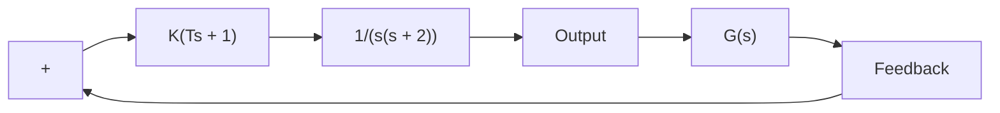
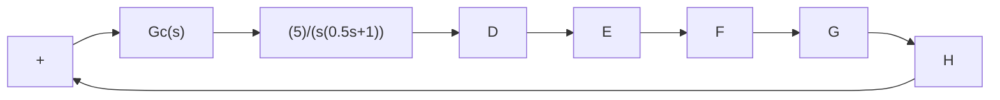
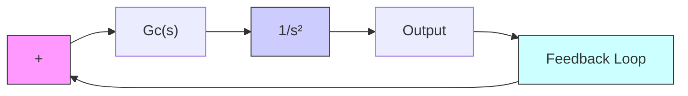

B–6–15. Determine the values of K, andT1, $T _ { 2 }$ of the system shown in Figure 6–105 so that the dominant closed-loop poles have the damping ratio $\zeta = 0 . 5$ and the undamped natural frequency $\omega _ { n } = 3 \mathrm { r a d / s e c } .$ .


<details>
<summary>flowchart</summary>

```mermaid
graph LR
    R --> |+| Sum
    Sum --> K["K (T₁s + 1)/(T₂s + 1)"]
    K --> |10/(s(s + 1))| C
    C --> |feedback| Sum
```
</details>

Figure 6–105 Control system.

B–6–16. Consider the control system shown in Figure 6–106. Determine the gain K and time constant T of the controller $G _ { c } ( s )$ such that the closed-loop poles are located at $s = - 2 \pm j 2$ .


<details>
<summary>flowchart</summary>


</details>

Figure 6–106 Control system.

B–6–17. Consider the system shown in Figure 6–107. Design a lead compensator such that the dominant closed-loop poles are located at $s = - 2 \pm j 2 { \sqrt { 3 } }$ Plot the unit-step re-. sponse curve of the designed system with MATLAB.


<details>
<summary>flowchart</summary>


</details>

Figure 6–107 Control system.

B–6–18. Consider the system shown in Figure 6–108. Design a compensator such that the dominant closed-loop poles are located at $s = - 1 \pm j 1$ .


<details>
<summary>flowchart</summary>


</details>

Figure 6–108 Control system.

B–6–19. Referring to the system shown in Figure 6–109, design a compensator such that the static velocity error constant $K _ { v } \operatorname { i s } \bar { 2 0 } \sec ^ { - 1 }$ without appreciably changing the original location $( s = - 2 \pm j 2 { \sqrt { 3 } } )$ of a pair of the complex-conjugate closed-loop poles.
