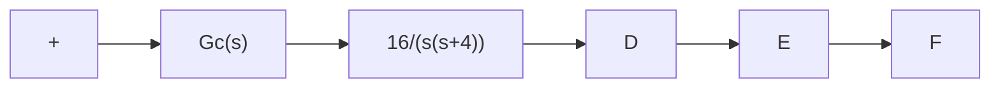
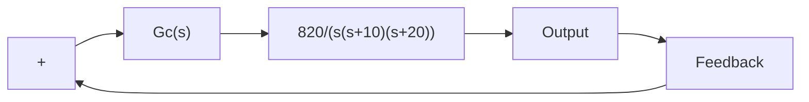
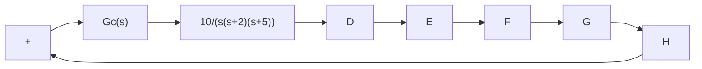

flowchart

Figure 6–109   
Control system.

B–6–20. Consider the angular-positional system shown in Figure 6–110. The dominant closed-loop poles are located at $s = - 3 . 6 0 \pm j 4 . 8 0$ The damping ratio z of the dominant. closed-loop poles is 0.6. The static velocity error constant $K _ { v }$ is $4 . 1 \ \mathrm { s e c } ^ { - 1 }$ , which means that for a ramp input of $3 6 0 ^ { \circ } ,$ sec the steady-state error in following the ramp input is

$$e _ {v} = \frac {\theta_ {i}}{K _ {v}} = \frac {3 6 0 ^ {\circ} / \sec}{4 . 1 \sec^ {- 1}} = 8 7. 8 ^ {\circ}$$

It is desired to decrease $e _ { v }$ to one-tenth of the present value, or to increase the value of the static velocity error constant $K _ { v } \mathrm { t o } 4 1 \mathrm { s e c } ^ { - 1 }$ . It is also desired to keep the damping ratio $\zeta$ of the dominant closed-loop poles at 0.6.A small change in the undamped natural frequency $\omega _ { n }$ of the dominant closedloop poles is permissible. Design a suitable lag compensator to increase the static velocity error constant as desired.

flowchart

Figure 6–110   
Angular-positional system.

B–6–21. Consider the control system shown in Figure 6–111. Design a compensator such that the dominant closed-loop poles are located at $s = - 2 \pm j 2 { \sqrt { 3 } }$ and the static velocity error constant $K _ { v }$ is 50 sec–1 .

flowchart

Figure 6–111   
Control system.

B–6–22. Consider the control system shown in Figure 6–112. Design a compensator such that the unit-step response curve will exhibit maximum overshoot of 30% or less and settling time of 3 sec or less.

flowchart

