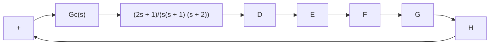
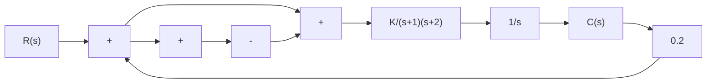
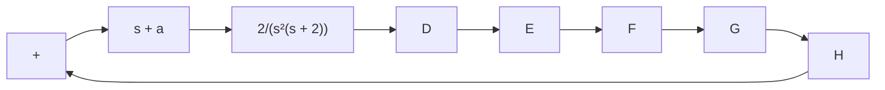

</details>

Figure 6–112   
Control system.

B–6–23. Consider the control system shown in Figure 6–113. Design a compensator such that the unit-step response curve will exhibit maximum overshoot of 25% or less and settling time of 5 sec or less.


<details>
<summary>flowchart</summary>


</details>

Figure 6–113   
Control system.

B–6–24. Consider the system shown in Figure 6–114, which involves velocity feedback. Determine the values of the amplifier gain K and the velocity feedback gain $K _ { h }$ so that the following specifications are satisfied:

1. Damping ratio of the closed-loop poles is 0.5   
2. Settling time - 2 sec   
3. Static velocity error constant $K _ { v } \geq 5 0 \ \mathrm { s e c } ^ { - 1 }$   
4. $0 < K _ { h } < 1$


<details>
<summary>flowchart</summary>

```mermaid
graph LR
    R["s"] --> |+| Sum1
    Sum1 --> |+| Sum2
    Sum2 --> |K/(2s+1)| A["1/s"]
    A --> C["s"]
    C --> |K_h| Sum1
    Sum1 --> |+| Sum2
```
</details>

Figure 6–114   
Control system.

B–6–25. Consider the system shown in Figure 6–115. The system involves velocity feedback. Determine the value of gain K such that the dominant closed-loop poles have a damping ratio of 0.5. Using the gain K thus determined, obtain the unit-step response of the system.


<details>
<summary>flowchart</summary>


</details>

Figure 6–115 Control system.

B–6–26. Consider the system shown in Figure 6–116. Plot the root loci as a varies from 0 to q. Determine the value of a such that the damping ratio of the dominant closed-loop poles is 0.5.


<details>
<summary>flowchart</summary>


</details>

Figure 6–116 Control system.
