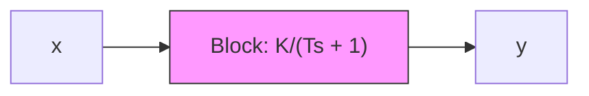

EXAMPLE 7–1 Consider the system shown in Figure 7–3. The transfer function $G ( s )$ is

$$G (s) = \frac {K}{T s + 1}$$

For the sinusoidal input $x ( t ) = X$ sin vt, the steady-state output $y _ { \mathrm { s s } } ( t )$ can be found as follows: Substituting jv for s in $G ( s )$ yields

$$G (j \omega) = \frac {K}{j T \omega + 1}$$

Figure 7–3 First-order system.   

flowchart

The amplitude ratio of the output to the input is

$$\left| G (j \omega) \right| = \frac {K}{\sqrt {1 + T ^ {2} \omega^ {2}}}$$

while the phase angle $\phi$ is

$$\phi = \underline {{\left\lfloor G (j \omega) \right.}} = - \tan^ {- 1} T \omega$$

Thus, for the input $x ( t ) = X$ sin vt, the steady-state output $y _ { \mathrm { s s } } ( t )$ can be obtained from Equation (7–5) as follows:

$$y _ {\mathrm{ss}} (t) = \frac {X K}{\sqrt {1 + T ^ {2} \omega^ {2}}} \sin (\omega t - \tan^ {- 1} T \omega) \tag {7-6}$$

From Equation (7–6), it can be seen that for small v, the amplitude of the steady-state output $y _ { \mathrm { s s } } ( t )$ is almost equal to K times the amplitude of the input. The phase shift of the output is small for small v. For large $\omega ,$ the amplitude of the output is small and almost inversely proportional to v. The phase shift approaches $- 9 0 ^ { \circ }$ as v approaches infinity. This is a phase-lag network.
