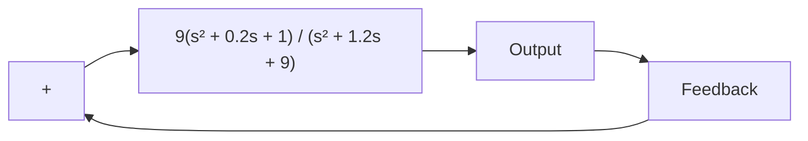

# MATLAB Program 7–2

num = [9 1.8 9];

den = [1 1.2 9 0];

bode(num,den)

title('Bode Diagram of G(s) = 9(s^2 + 0.2s + 1)/[s(s^2 + 1.2s + 9)]')

Figure 7–21 Control system.   

flowchart

Figure 7–22 Bode diagram of

$$G (s) = \frac {9 \left(s ^ {2} + 0 . 2 s + 1\right)}{s \left(s ^ {2} + 1 . 2 s + 9\right)}.$$

line

| Frequency (rad/sec) | Magnitude (dB) | Phase (deg) |
| --- | --- | --- |
| 0.01 | 40 | - |
| 0.1 | 20 | - |
| 1 | -10 | 60 |
| 10 | 0 | - |

If it is desired to plot the Bode diagram from 0.01 to 1000 radsec, enter the following command:

$$w = \text { logspace } (- 2, 3, 1 0 0)$$

This command generates 100 points logarithmically equally spaced between 0.01 and 100 radsec. (Note that such a vector w specifies the frequencies in radians per second at which the frequency response will be calculated.)

If we use the command

$$\text { bode(num,den,w) }$$

then the frequency range is as the user specified, but the magnitude range and phase-angle range will be automatically determined. See MATLAB Program 7–3 and the resulting plot in Figure 7–23.
