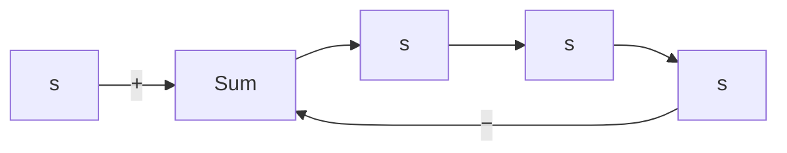

# 7–5 NYQUIST STABILITY CRITERION

The Nyquist stability criterion determines the stability of a closed-loop system from its open-loop frequency response and open-loop poles.

This section presents mathematical background for understanding the Nyquist stability criterion. Consider the closed-loop system shown in Figure 7–44. The closed-loop transfer function is

$$\frac {C (s)}{R (s)} = \frac {G (s)}{1 + G (s) H (s)}$$

Figure 7–44 Closed-loop system.   

flowchart

For stability, all roots of the characteristic equation

$$1 + G (s) H (s) = 0$$

must lie in the left-half s plane. [It is noted that, although poles and zeros of the open-loop transfer function $G ( s ) H ( s )$ may be in the right-half s plane, the system is stable if all the poles of the closed-loop transfer function (that is, the roots of the characteristic equation) are in the left-half s plane.] The Nyquist stability criterion relates the open-loop frequency response $G ( j \omega ) H ( j \omega )$ to the number of zeros and poles of $1 + G ( s ) H ( s )$ that lie in the right-half s plane.This criterion, derived by H. Nyquist, is useful in control engineering because the absolute stability of the closed-loop system can be determined graphically from open-loop frequency-response curves, and there is no need for actually determining the closed-loop poles. Analytically obtained open-loop frequency-response curves, as well as those experimentally obtained, can be used for the stability analysis.This is convenient because, in designing a control system, it often happens that mathematical expressions for some of the components are not known; only their frequency-response data are available.

The Nyquist stability criterion is based on a theorem from the theory of complex variables. To understand the criterion, we shall first discuss mappings of contours in the complex plane.
