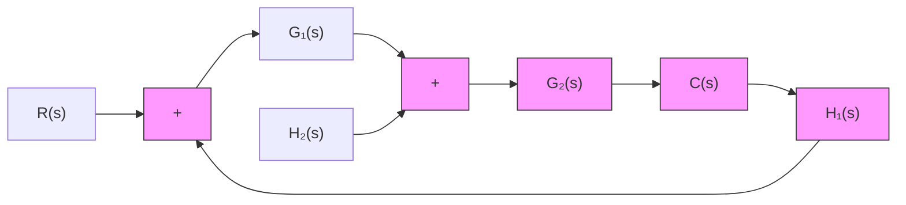

Conditionally Stable Systems. Figure 7–58 shows an example of a $G ( j \omega ) H ( j \omega )$ locus for which the closed-loop system can be made unstable by varying the open-loop gain. If the open-loop gain is increased sufficiently, the $G ( j \omega ) H ( j \omega )$ locus encloses the $- 1 + j 0$ point twice, and the system becomes unstable. If the open-loop gain is decreased sufficiently, again the $G ( j \omega ) H ( j \omega )$ locus encloses the $- 1 + j 0$ point twice. For stable operation of the system considered here, the critical point $- 1 + j 0$ must not be located in the regions between $O A$ and BC shown in Figure 7–58. Such a system that is stable only for limited ranges of values of the open-loop gain for which the $- 1 + j 0$ point is completely outside the $G ( j \omega ) H ( j \omega )$ locus is a conditionally stable system.

A conditionally stable system is stable for the value of the open-loop gain lying between critical values, but it is unstable if the open-loop gain is either increased or decreased sufficiently. Such a system becomes unstable when large input signals are applied, since a large signal may cause saturation, which in turn reduces the open-loop gain of the system. It is advisable to avoid such a situation.

Multiple-Loop System. Consider the system shown in Figure 7–59.This is a multiple-loop system. The inner loop has the transfer function

$$G (s) = \frac {G _ {2} (s)}{1 + G _ {2} (s) H _ {2} (s)}$$

flowchart

Figure 7–59 Multiple-loop system.
