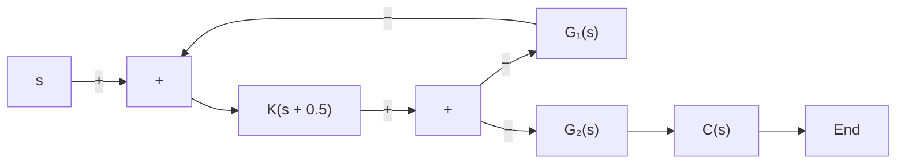

# EXAMPLE 7–19

Consider the control system shown in Figure 7–60.The system involves two loops. Determine the range of gain K for stability of the system by the use of the Nyquist stability criterion. (The gain K is positive.)

To examine the stability of the control system, we need to sketch the Nyquist locus of $G ( s )$ , where

$$G (s) = G _ {1} (s) G _ {2} (s)$$

However, the poles of $G ( s )$ are not known at this point.Therefore, we need to examine the minor loop if there are right-half s-plane poles. This can be done easily by use of the Routh stability criterion. Since

$$G _ {2} (s) = \frac {1}{s ^ {3} + s ^ {2} + 1}$$

the Routh array becomes as follows:

$$
\begin{array}{l} s ^ {3} \quad 1 \quad 0 \\ s ^ {2} \quad 1 \quad 1 \\ \begin{array}{c c c} s ^ {1} & - 1 & 0 \end{array} \\ s ^ {0} \quad 1 \\ \end{array}
$$

Notice that there are two sign changes in the first column. Hence, there are two poles of $G _ { 2 } ( s )$ in the right-half s plane.

Once we find the number of right-half s plane poles of $G _ { 2 } ( s )$ , we proceed to sketch the Nyquist locus of $G ( s )$ , where

$$G (s) = G _ {1} (s) G _ {2} (s) = \frac {K (s + 0 . 5)}{s ^ {3} + s ^ {2} + 1}$$

Figure 7–60 Control system.   

flowchart

Our problem is to determine the range of the gain K for stability. Hence, instead of plotting Nyquist loci of $G ( j \omega )$ for various values of K, we plot the Nyquist locus of $G ( j \omega ) / K$ . Figure 7–61 shows the Nyquist plot or polar plot of $G ( j \omega ) / K$ .

Since $G ( s )$ has two poles in the right-half s plane, we have $P = 2 .$ Noting that.

$$Z = N + P$$

for stability, we require $Z = 0$ or $N = - 2 .$ That is, the Nyquist locus of $G ( j \omega )$ must encircle the $- 1 + j 0$ point twice counterclockwise. From Figure 7–61, we see that, if the critical point lies between 0 and –0.5, then the $G ( j \omega ) / K$ locus encircles the critical point twice counterclockwise. Therefore, we require

$$- 0. 5 K < - 1$$

The range of the gain K for stability is

$$2 < K$$

  
Figure 7–61 Polar plot of $G ( j \omega ) / K .$
