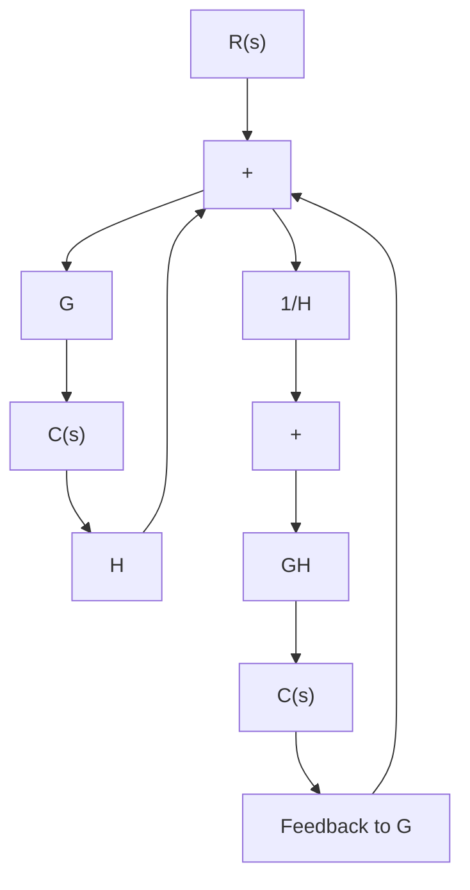

# 7–7 RELATIVE STABILITY ANALYSIS

Relative Stability. In designing a control system, we require that the system be stable. Furthermore, it is necessary that the system have adequate relative stability.

In this section, we shall show that the Nyquist plot indicates not only whether a system is stable, but also the degree of stability of a stable system.The Nyquist plot also gives information as to how stability may be improved, if this is necessary.

In the following discussion, we shall assume that the systems considered have unity feedback. Note that it is always possible to reduce a system with feedback elements to a unity-feedback system, as shown in Figure 7–62. Hence, the extension of relative stability analysis for the unity-feedback system to nonunity-feedback systems is possible.

We shall also assume that, unless otherwise stated, the systems are minimum-phase systems; that is, the open-loop transfer function has neither poles nor zeros in the righthalf s plane.

Relative Stability Analysis by Conformal Mapping. One of the important problems in analyzing a control system is to find all closed-loop poles or at least those closest to the jv axis (or the dominant pair of closed-loop poles). If the open-loop frequency-response characteristics of a system are known, it may be possible to estimate the closed-loop poles closest to the jv axis. It is noted that the Nyquist locus G(jv) need not be an analytically known function of v. The entire Nyquist locus may be experimentally obtained. The technique to be presented here is essentially graphical and is based on a conformal mapping of the s plane into the G(s) plane.

flowchart

Figure 7–62 Modification of a system with feedback elements to a unityfeedback system.

Figure 7–63 Conformal mapping of s-plane grids into the G(s) plane.   

line

| σ | jω |
| --- | --- |
| -σ₄ | jω₄ |
| -σ₃ | jω₃ |
| -σ₂ | jω₂ |
| -σ₁ | jω₁ |

