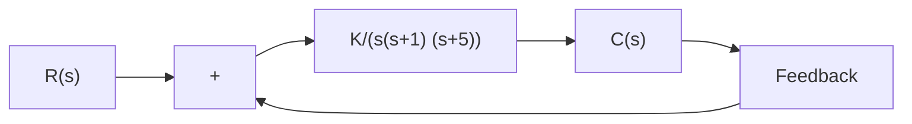

# EXAMPLE 7–20

Obtain the phase and gain margins of the system shown in Figure 7–69 for the two cases where K=10 and K=100.

Figure 7–69 Control system.   

flowchart

  
(a)

  
(b)   
Figure 7–70 Bode diagrams of the system shown in Figure 7–69; (a) with K=10 and (b) with K=100.

The phase and gain margins can easily be obtained from the Bode diagram.A Bode diagram of the given open-loop transfer function with K=10 is shown in Figure 7–70(a).The phase and gain margins for K=10 are

$$\text { Phase margin } = 2 1 ^ {\circ}, \quad \text { Gain margin } = 8 \mathrm{dB}$$

Therefore, the system gain may be increased by 8 dB before the instability occurs.

Increasing the gain from K=10 to K=100 shifts the 0-dB axis down by 20 dB, as shown in Figure 7–70(b). The phase and gain margins are

$$\text { Phase margin } = - 3 0 ^ {\circ}, \quad \text { Gain margin } = - 1 2 \mathrm{dB}$$

Thus, the system is stable for K=10, but unstable for K=100.

Notice that one of the very convenient aspects of the Bode diagram approach is the ease with which the effects of gain changes can be evaluated. Note that to obtain satisfactory performance, we must increase the phase margin to 30° \~ 60°. This can be done by decreasing the gain K. Decreasing K is not desirable, however, since a small value of K will yield a large error for the ramp input. This suggests that reshaping of the open-loop frequency-response curve by adding compensation may be necessary. Compensation techniques are discussed in detail in Sections 7–11 through 7–13.

Obtaining Gain Margin, Phase Margin, Phase-Crossover Frequency, and Gain-Crossover Frequency with MATLAB. The gain margin, phase margin, phase-crossover frequency, and gain-crossover frequency can be obtained easily with MATLAB.The command to be used is

$$[ \mathrm{Gm}, \mathrm{pm}, \mathrm{wcp}, \mathrm{wcg} ] = \text { margin(sys) }$$

where Gm is the gain margin, pm is the phase margin, wcp is the phase-crossover frequency, and wcg is the gain-crossover frequency. For details of how to use this command, see Example 7–21.
