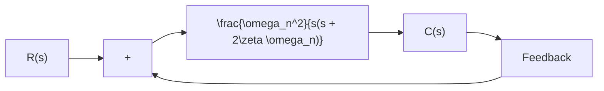

The frequency $\omega _ { r }$ is the resonant frequency. At the resonant frequency, the value of M is maximum and is given by Equation (7–13), rewritten

$$M _ {r} = \frac {1}{2 \zeta \sqrt {1 - \zeta^ {2}}} \tag {7-18}$$

where $M _ { r }$ is defined as the resonant peak magnitude. The resonant peak magnitude is related to the damping of the system.

The magnitude of the resonant peak gives an indication of the relative stability of the system. A large resonant peak magnitude indicates the presence of a pair of dominant closed-loop poles with small damping ratio, which will yield an undesirable transient response.A smaller resonant peak magnitude, on the other hand, indicates the absence of a pair of dominant closed-loop poles with small damping ratio, meaning that the system is well damped.

Remember that $\omega _ { r }$ is real only if $\zeta < 0 . 7 0 7$ . Thus, there is no closed-loop resonance if $\zeta > 0 . 7 0 7$ . [The value of $M _ { r }$ is unity only if $\zeta > 0 . 7 0 7$ . See Equation (7–14).] Since the values of $M _ { r }$ and $\omega _ { r }$ can be easily measured in a physical system, they are quite useful for checking agreement between theoretical and experimental analyses.

Figure 7–73 Standard secondorder system.   

flowchart

It is noted, however, that in practical design problems the phase margin and gain margin are more frequently specified than the resonant peak magnitude to indicate the degree of damping in a system.

Correlation between Step Transient Response and Frequency Response in the Standard Second-Order System. The maximum overshoot in the unit-step response of the standard second-order system, as shown in Figure 7–73, can be exactly correlated with the resonant peak magnitude in the frequency response. Hence, essentially the same information about the system dynamics is contained in the frequency response as is in the transient response.

For a unit-step input, the output of the system shown in Figure 7–73 is given by Equation (5–12), or

$$c (t) = 1 - e ^ {- \zeta \omega_ {n} t} \left(\cos \omega_ {d} t + \frac {\zeta}{\sqrt {1 - \zeta^ {2}}} \sin \omega_ {d} t\right), \quad \text { for } t \geq 0$$

where
