# 7–8 CLOSED-LOOP FREQUENCY RESPONSE OF UNITY-FEEDBACK SYSTEMS

Closed-Loop Frequency Response. For a stable, unity-feedback closed-loop system, the closed-loop frequency response can be obtained easily from that of the openloop frequency response. Consider the unity-feedback system shown in Figure 7–80(a). The closed-loop transfer function is

$$\frac {C (s)}{R (s)} = \frac {G (s)}{1 + G (s)}$$

In the Nyquist or polar plot shown in Figure 7–80(b), the vector $\overrightarrow { O A }$ represents $G \big ( j \omega _ { 1 } \big )$ , where $\omega _ { 1 }$ is the frequency at point A. The length of the vector $\overrightarrow { O A }$ is $\left| G \big ( j \omega _ { 1 } \big ) \right|$ and the angle of the vector $\overrightarrow { O A }$ is $\left/ G ( j \omega _ { 1 } ) \right.$ The vector. ${ \overrightarrow { P A } } .$ the vector from the!, $- 1 + j 0$ point to the Nyquist locus, represents $1 + G \big ( j \omega _ { 1 } \big )$ . Therefore, the ratio of $\overrightarrow { O A }$ to, $\overrightarrow { P A }$ represents the closed-loop frequency response, or

$$\frac {\overrightarrow {O A}}{\overrightarrow {P A}} = \frac {G (j \omega_ {1})}{1 + G (j \omega_ {1})} = \frac {C (j \omega_ {1})}{R (j \omega_ {1})}$$

Figure 7–80 (a) Unity-feedback system; (b) determination of closed-loop frequency response from open-loop frequency response.   

```mermaid
graph LR
    A["+"] --> B["G(s)"]
    B --> C
    C --> D
    D --> E
    E --> F
    F --> G
    G --> H
    H --> I
    I --> J
    J --> K
    K --> L
    L --> M
    M --> N
    N --> O
    O --> P
    P --> Q
    Q --> R
    R --> S
    S --> T
    T --> U
    U --> V
    V --> W
    W --> X
    X --> Y
    Y --> Z
    Z --> A
```

flowchart

(a)

text_image

-1 + j0
P
θ
ω₁
A
φ - θ
Im
O
Re
G (jω)

(b)
