line

| ω in rad/sec | dB |
| --- | --- |
| 0.1/T | 0 |
| 1/T | -20 |
| √10/T | 0 |
| 10/T | 0 |
| 100/T | 0 |

Figure 7–92 Bode diagram of a lead compensator $\alpha ( j \omega T + 1 ) / ( j \omega \alpha T + 1 ) .$ , where $\alpha = 0 . 1$ .

Hence,

$$\omega_ {m} = \frac {1}{\sqrt {\alpha} T} \tag {7-26}$$

As seen from Figure 7–92, the lead compensator is basically a high-pass filter. (The high frequencies are passed, but low frequencies are attenuated.)

Lead Compensation Techniques Based on the Frequency-Response Approach. The primary function of the lead compensator is to reshape the frequency-response curve to provide sufficient phase-lead angle to offset the excessive phase lag associated with the components of the fixed system.

Consider the system shown in Figure 7–93. Assume that the performance specifications are given in terms of phase margin, gain margin, static velocity error constants, and so on. The procedure for designing a lead compensator by the frequency-response approach may be stated as follows:

1. Assume the following lead compensator:

$$G _ {c} (s) = K _ {c} \alpha \frac {T s + 1}{\alpha T s + 1} = K _ {c} \frac {s + \frac {1}{T}}{s + \frac {1}{\alpha T}} \quad (0 < \alpha < 1)$$

Define

$$K _ {c} \alpha = K$$

Then

$$G _ {c} (s) = K \frac {T s + 1}{\alpha T s + 1}$$

The open-loop transfer function of the compensated system is

$$G _ {c} (s) G (s) = K \frac {T s + 1}{\alpha T s + 1} G (s) = \frac {T s + 1}{\alpha T s + 1} K G (s) = \frac {T s + 1}{\alpha T s + 1} G _ {1} (s)$$

where

$$G _ {1} (s) = K G (s)$$

Determine gain K to satisfy the requirement on the given static error constant.

2. Using the gain K thus determined, draw a Bode diagram of $G _ { 1 } ( j \omega )$ , the gainadjusted but uncompensated system. Evaluate the phase margin.   
3. Determine the necessary phase-lead angle to be added to the system. Add an additional $5 ^ { \circ }$ to $1 2 ^ { \circ }$ to the phase-lead angle required, because the addition of the

```mermaid
graph LR
    A["+"] --> B["Gc(s)"]
    B --> C["G(s)"]
    C --> D
    D --> E
    E --> F
    F --> G
    G --> H
    H --> I
    I --> J
    J --> K
    K --> L
    L --> M
    M --> N
    N --> O
    O --> P
    P --> Q
    Q --> R
    R --> S
    S --> T
    T --> U
    U --> V
    V --> W
    W --> X
    X --> Y
    Y --> Z
    Z --> A
```

flowchart

Figure 7–93 Control system.

lead compensator shifts the gain crossover frequency to the right and decreases the phase margin.
