4. Determine the attenuation factor a by use of Equation (7–25). Determine the frequency where the magnitude of the uncompensated system $G _ { 1 } ( j \omega )$ is equal to $- 2 0 \log \left( \mathrm { { i } } / \sqrt { \alpha } \right)$ Select this frequency as the new gain crossover frequency. This. frequency corresponds to $\omega _ { m } = 1 / { \left( \sqrt { \alpha } T \right) }$ and the maximum phase shift, $\phi _ { m }$ occurs at this frequency.

5. Determine the corner frequencies of the lead compensator as follows:

Zero of lead compensator: $\omega = { \frac { 1 } { T } }$

Pole of lead compensator: $\omega = { \frac { 1 } { \alpha T } }$

6. Using the value of K determined in step 1 and that of a determined in step 4, calculate constant $K _ { c }$ from

$$K _ {c} = \frac {K}{\alpha}$$

7. Check the gain margin to be sure it is satisfactory. If not, repeat the design process by modifying the pole–zero location of the compensator until a satisfactory result is obtained.

EXAMPLE 7–26 Consider the system shown in Figure 7–94. The open-loop transfer function is

$$G (s) = \frac {4}{s (s + 2)}$$

It is desired to design a compensator for the system so that the static velocity error constant $K _ { v }$ is $2 0 \mathrm { s e c } ^ { - 1 }$ , the phase margin is at least 50°, and the gain margin is at least 10 dB.

We shall use a lead compensator of the form

$$G _ {c} (s) = K _ {c} \alpha \frac {T s + 1}{\alpha T s + 1} = K _ {c} \frac {s + \frac {1}{T}}{s + \frac {1}{\alpha T}}$$

The compensated system will have the open-loop transfer function $G _ { c } ( s ) G ( s )$ .

Define

$$G _ {1} (s) = K G (s) = \frac {4 K}{s (s + 2)}$$

where $K = K _ { c } \alpha .$

Figure 7–94 Control system.   

```mermaid
graph LR
    A["+"] --> B["4/(s(s+2))"]
    B --> C
    C --> D
    D --> E
    E --> F
    F --> G
    G --> H
    H --> I
    I --> J
    J --> K
    K --> L
    L --> M
    M --> N
    N --> O
    O --> P
    P --> Q
    Q --> R
    R --> S
    S --> T
    T --> U
    U --> V
    V --> W
    W --> X
    X --> Y
    Y --> Z
    Z --> A
```

flowchart

The first step in the design is to adjust the gain K to meet the steady-state performance specification or to provide the required static velocity error constant. Since this constant is given as $2 0 \mathrm { s e c } ^ { - 1 }$ , we obtain

$$K _ {v} = \lim _ {s \rightarrow 0} s G _ {c} (s) G (s) = \lim _ {s \rightarrow 0} s \frac {T s + 1}{\alpha T s + 1} G _ {1} (s) = \lim _ {s \rightarrow 0} \frac {s 4 K}{s (s + 2)} = 2 K = 2 0$$

or

$$K = 1 0$$
