Note that for type 1 systems, such as the system just considered, the value of the static velocity error constant $K _ { v }$ is merely the value of the frequency corresponding to the intersection of the extension of the initial –20-dBdecade slope line and the 0-dB line, as shown in Figure 7–96. Note also that we have changed the slope of the magnitude curve near the gain crossover frequency from –40 dBdecade to –20 dBdecade.

Figure 7–97 Compensated system.   

```mermaid
graph LR
    A["+"] --> B["41.7(s + 4.41) / s + 18.4"]
    B --> C["4 / (s(s + 2))"]
    C --> D
    D --> E
    E --> F
    F --> G
    G --> H
    H --> I
    I --> J
    J --> K
    K --> L
    L --> M
    M --> N
    N --> O
    O --> P
    P --> Q
    Q --> R
    R --> S
    S --> T
    T --> U
    U --> V
    V --> W
    W --> X
    X --> Y
    Y --> Z
    Z --> A
```

flowchart

Figure 7–98 shows the polar plots of the gain-adjusted but uncompensated open-loop transfer function $G _ { 1 } ( j \omega ) = 1 0 G ( j \omega )$ and the compensated open-loop transfer function $G _ { c } ( j \omega ) G ( j \omega )$ . From Figure 7–98, we see that the resonant frequency of the uncompensated system is about 6 radsec and that of the compensated system is about 7 radsec. (This also indicates that the bandwidth has been increased.)

From Figure 7–98, we find that the value of the resonant peak Mr for the uncompensated system with K=10 is 3.The value of Mr for the compensated system is found to be 1.29.This clearly shows that the compensated system has improved relative stability.

Note that, if the phase angle of $G _ { 1 } ( j \omega )$ decreases rapidly near the gain crossover frequency, lead compensation becomes ineffective because the shift in the gain crossover frequency to the right makes it difficult to provide enough phase lead at the new gain crossover frequency. This means that, to provide the desired phase margin, we must use a very small value for a. The value of a, however, should not be too small (smaller than 0.05) nor should the maximum phase lead $\phi _ { m }$ be too large (larger than 65°), because such values will require an additional gain of excessive value. [If more than $6 5 ^ { \circ }$ is needed, two (or more) lead networks may be used in series with an isolating amplifier.]
