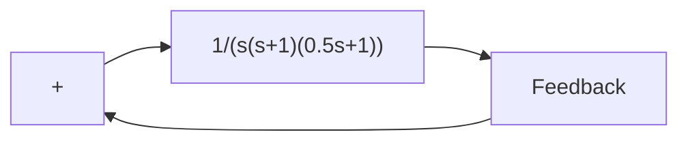

The first step in the design is to adjust the gain K to meet the required static velocity error constant. Thus,

$$
\begin{array}{l} K _ {v} = \lim _ {s \rightarrow 0} s G _ {c} (s) G (s) = \lim _ {s \rightarrow 0} s \frac {T s + 1}{\beta T s + 1} G _ {1} (s) = \lim _ {s \rightarrow 0} s G _ {1} (s) \\ = \lim _ {s \rightarrow 0} \frac {s K}{s (s + 1) (0 . 5 s + 1)} = K = 5 \\ \end{array}
$$

or

$$K = 5$$

With K=5, the compensated system satisfies the steady-state performance requirement.

We shall next plot the Bode diagram of

$$G _ {1} (j \omega) = \frac {5}{j \omega (j \omega + 1) (0 . 5 j \omega + 1)}$$

Figure 7–103 Control system.   

flowchart

Figure 7–104 Bode diagrams for $G _ { 1 }$ (gain-adjusted but uncompensated open-loop transfer function), $G _ { c }$ (compensator), and $G _ { c } G$ (compensated open-loop transfer function).   

line

| ω in rad/sec | dB (Gc/K) | dB (Gc/G) | dB (G1) | dB (Gc/G) | Angle (°) |
| --- | --- | --- | --- | --- | --- |
| 0.004 | 0 | 0 | 0 | 0 | -90 |
| 0.01 | -5 | -5 | -5 | -5 | -90 |
| 0.02 | -10 | -10 | -10 | -10 | -90 |
| 0.04 | -15 | -15 | -15 | -15 | -90 |
| 0.1 | -20 | -20 | -20 | -20 | -90 |
| 0.2 | -25 | -25 | -25 | -25 | -90 |
| 0.4 | -30 | -30 | -30 | -30 | -90 |
| 0.6 | -35 | -35 | -35 | -35 | -90 |
| 1 | -40 | -40 | -40 | -40 | -90 |
| 2 | -45 | -45 | -45 | -45 | -90 |
| 4 | -50 | -50 | -50 | -50 | -90 |

The magnitude curve and phase-angle curve of $G _ { 1 } ( j \omega )$ are shown in Figure 7–104. From this plot, the phase margin is found to be $- 2 0 ^ { \circ }$ , which means that the gain-adjusted but uncompensated system is unstable.
