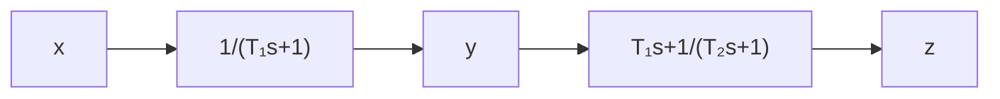

Cancellation of Undesirable Poles. Since the transfer function of elements in cascade is the product of their individual transfer functions, it is possible to cancel some undesirable poles or zeros by placing a compensating element in cascade, with its poles and zeros being adjusted to cancel the undesirable poles or zeros of the original system. For example, a large time constant $T _ { 1 }$ may be canceled by use of the lead network $( T _ { 1 } s + 1 ) \bar { / } ( T _ { 2 } s + 1 \bar { ) }$ as follows:

$$\left(\frac {1}{T _ {1} s + 1}\right) \left(\frac {T _ {1} s + 1}{T _ {2} s + 1}\right) = \frac {1}{T _ {2} s + 1}$$

If $T _ { 2 }$ is much smaller than $T _ { 1 }$ we can effectively eliminate the large time constant, $T _ { 1 }$ . Figure 7–116 shows the effect of canceling a large time constant in step transient response.

If an undesirable pole in the original system lies in the right-half s plane, this compensation scheme should not be used since, although mathematically it is possible to cancel the undesirable pole with an added zero, exact cancellation is physically impossible because of inaccuracies involved in the location of the poles and zeros. A pole in the right-half s plane not exactly canceled by the compensator zero will eventually lead to unstable operation, because the response will involve an exponential term that increases with time.

It is noted that if a left-half plane pole is almost canceled but not exactly canceled, as is almost always the case, the uncanceled pole-zero combination will cause the response to have a small amplitude but long-lasting transient-response component. If the cancellation is not exact but is reasonably good, then this component will be small.

It should be noted that the ideal control system is not the one that has a transfer function of unity. Physically, such a control system cannot be built since it cannot

Figure 7–116

Step-response curves showing the effect of canceling a large time constant.

flowchart

