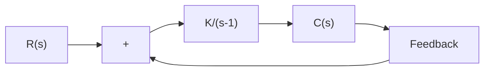

A–7–9. Consider the closed-loop system shown in Figure 7–124. Determine the critical value of K for stability by the use of the Nyquist stability criterion.

Solution. The polar plot of

$$G (j \omega) = \frac {K}{j \omega - 1}$$

is a circle with center at $- K / 2$ on the negative real axis and radius $K / 2$ , as shown in Figure $7 - 1 2 5 ( \mathrm { a } )$ . As v is increased from – q to q, the $G ( j \omega )$ locus makes a counterclockwise rotation. In this system, $P = 1$ because there is one pole of $G ( s )$ in the right-half s plane. For the closedloop system to be stable, Z must be equal to zero. Therefore, $N = Z - P$ must be equal to –1, or there must be one counterclockwise encirclement of the $- 1 + j 0$ point for stability. (If there is no encirclement of the $- 1 + j 0$ point, the system is unstable.) Thus, for stability, K must be greater than unity, and $K = 1$ gives the stability limit. Figure 7–125(b) shows both stable and unstable cases of $G ( j \omega )$ plots.

text_image

Im
G Plane
K/2
ω = 0
- K/2
ω = -∞
ω = ∞
Re

(a)

text_image

Im
G Plane
ω = 0
-1
ω = -∞
Re
P = 1
N = -1
Z = 0
ω = ∞
(Stable)
K > 1

text_image

Im
G Plane
ω = 0
ω = -∞
-1
Re
P = 1
N = 0
Z = 1
(Unstable)
K < 1

Figure 7–125

(a) Polar plot of K $/ ( j \omega - 1 ) ;$ ;

(b) polar plots of

$K / ( j \omega - 1 )$ for stable and unstable cases.

A–7–10. Consider a unity-feedback system whose open-loop transfer function is

$$G (s) = \frac {K e ^ {- 0 . 8 s}}{s + 1}$$

Using the Nyquist plot, determine the critical value of K for stability.

Solution. For this system,

$$
\begin{array}{l} G (j \omega) = \frac {K e ^ {- 0 . 8 j \omega}}{j \omega + 1} \\ = \frac {K (\cos 0 . 8 \omega - j \sin 0 . 8 \omega) (1 - j \omega)}{1 + \omega^ {2}} \\ = \frac {K}{1 + \omega^ {2}} \left[ (\cos 0. 8 \omega - \omega \sin 0. 8 \omega) - j (\sin 0. 8 \omega + \omega \cos 0. 8 \omega) \right] \\ \end{array}
$$

The imaginary part of $G ( j \omega )$ is equal to zero if

$$\sin 0. 8 \omega + \omega \cos 0. 8 \omega = 0$$

Hence,

$$\omega = - \tan 0. 8 \omega$$
