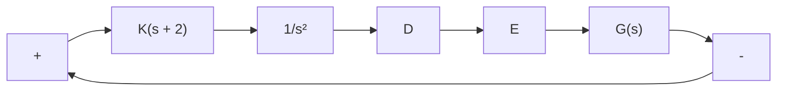

$$
\begin{array}{l} \frac {K}{G (j \omega)} = \left[ \frac {(j \omega) ^ {3} + (j \omega) ^ {2} + 1}{j \omega + 0 . 5} \right] \left(\frac {0 . 5 - j \omega}{0 . 5 - j \omega}\right) \\ = \frac {0 . 5 - 0 . 5 \omega^ {2} - \omega^ {4} + j \omega (- 1 + 0 . 5 \omega^ {2})}{0 . 2 5 + \omega^ {2}} \\ \end{array}
$$

text_image

K/G Locus
Im
K/G Plane
∞
ω = √2
ω = 0
-2 0 2
Re
-∞ ← ω

Figure 7–132 Polar plot of $K / G ( j \omega )$ .

the $K / G ( j \omega )$ locus crosses the negative real axis at $\omega = \sqrt { 2 }$ and the crossing point at the nega-, tive real axis is –2.

From Figure 7–132, we see that if the critical point lies in the region between –2 and $- \infty ,$ then the critical point is not encircled. Hence, for stability, we require

$$- 1 < \frac {- 2}{K}$$

Thus, the range of gain K for stability is

$$2 < K$$

which is the same result as we obtained in Example 7–19.

A–7–16. Figure 7–133 shows a block diagram of a space-vehicle control system. Determine the gain K such that the phase margin is 50°. What is the gain margin in this case?

Solution. Since

$$G (j \omega) = \frac {K (j \omega + 2)}{(j \omega) ^ {2}}$$

we have

$$\underline {{G (j \omega)}} = \underline {{j \omega + 2}} - 2 \underline {{j \omega}} = \tan^ {- 1} \frac {\omega}{2} - 1 8 0 ^ {\circ}$$

The requirement that the phase margin be $5 0 ^ { \circ }$ means that $\left. \boldsymbol { G } ( j \omega _ { c } ) \right.$ must be equal to $- 1 3 0 ^ { \circ }$ , where $\omega _ { c }$ is the gain crossover frequency, or

$$\underline {{G (j \omega_ {c})}} = - 1 3 0 ^ {\circ}$$

Figure 7–133 Space-vehicle control system.   

flowchart

Hence, we set

$$\tan^ {- 1} \frac {\omega_ {c}}{2} = 5 0 ^ {\circ}$$

from which we obtain

$$\omega_ {c} = 2. 3 8 3 5 \mathrm{rad/sec}$$

Since the phase curve never crosses the $- 1 8 0 ^ { \circ }$ line, the gain margin is ±q dB. Noting that the magnitude of $G ( j \omega )$ must be equal to 0 dB at $\omega = 2 . 3 8 3 5$ , we have

$$\left| \frac {K (j \omega + 2)}{(j \omega) ^ {2}} \right| _ {\omega = 2. 3 8 3 5} = 1$$

from which we get

$$K = \frac {2 . 3 8 3 5 ^ {2}}{\sqrt {2 ^ {2} + 2 . 3 8 3 5 ^ {2}}} = 1. 8 2 5 9$$

This K value will give the phase margin of $5 0 ^ { \circ }$
