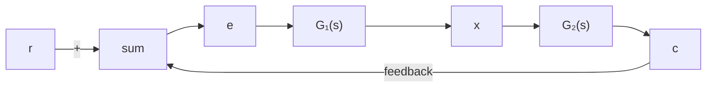

Solution. One possible approach is to measure the frequency-response characteristics of the unstable element by using it as a part of a stable system.

Figure 7–136 Control system.   

flowchart

Consider the system shown in Figure 7–136. Suppose that the element $G _ { 1 } ( s )$ is unstable. The complete system may be made stable by choosing a suitable linear element $G _ { 2 } ( s )$ . We apply a sinusoidal signal at the input. At steady state, all signals in the loop will be sinusoidal. We measure the signals $e ( t )$ , the input to the unstable element, and $x ( t )$ , the output of the unstable element. By changing the frequency [and possibly the amplitude for the convenience of measuring $e ( t )$ and $x ( t ) ]$ of the input sinusoid and repeating this process, it is possible to obtain the frequency response of the unstable linear element.

A–7–20. Show that the lead network and lag network inserted in cascade in an open loop act as proportional-plus-derivative control (in the region of small v) and proportional-plus-integral control (in the region of large v), respectively.

Solution. In the region of small v, the polar plot of the lead network is approximately the same as that of the proportional-plus-derivative controller. This is shown in Figure 7–137(a).

Similarly, in the region of large $\omega ,$ the polar plot of the lag network approximates the proportional-plus-integral controller, as shown in Figure 7–137(b).

A–7–21. Consider a lag–lead compensator $G _ { c } ( s )$ defined by

$$G _ {c} (s) = K _ {c} \frac {\left(s + \frac {1}{T _ {1}}\right) \left(s + \frac {1}{T _ {2}}\right)}{\left(s + \frac {\beta}{T _ {1}}\right) \left(s + \frac {1}{\beta T _ {2}}\right)}$$

Show that at frequency $\omega _ { 1 }$ , where

$$\omega_ {1} = \frac {1}{\sqrt {T _ {1} T _ {2}}}$$

the phase angle of $G _ { c } ( j \omega )$ becomes zero. (This compensator acts as a lag compensator for $0 < \omega < \omega _ { 1 }$ and acts as a lead compensator for $\omega _ { 1 } < \omega < \infty . )$ (Refer to Figure 7–109.)
