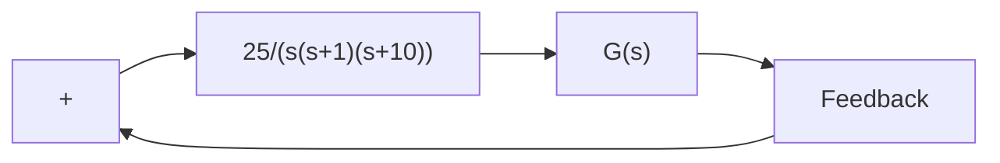

Figure 7–1 Nyquist plots.

B–7–17. A Nyquist plot of a unity-feedback system with the feedforward transfer function G(s) is shown in Figure 7–159.

If G(s) has one pole in the right-half s plane, is the system stable?

If G(s) has no pole in the right-half s plane, but has one zero in the right-half s plane, is the system stable?

text_image

Im
0
Re
G(jω)
-1
Figure
Nyq

ure 7–159 uist plot.

B–7–18. Consider the unity-feedback control system with the following open-loop transfer function $G ( s )$ :

$$G (s) = \frac {K (s + 2)}{s (s + 1) (s + 1 0)}$$

Plot Nyquist diagrams of $G ( s )$ for K=1, 10, and 100.

B–7–19. Consider a negative-feedback system with the following open-loop transfer function:

$$G (s) = \frac {2}{s (s + 1) (s + 2)}$$

Plot the Nyquist diagram of $G ( s )$ . If the system were a positive-feedback one with the same open-loop transfer function $G ( s )$ , what would the Nyquist diagram look like?

B–7–20. Consider the control system shown in Figure 7–160. Plot Nyquist diagrams of $G ( s )$ , where

$$
\begin{array}{l} G (s) = \frac {1 0}{s [ (s + 1) (s + 5) + 1 0 k ]} \\ = \frac {1 0}{s ^ {3} + 6 s ^ {2} + (5 + 1 0 k) s} \\ \end{array}
$$

for k=0.3, 0.5, and 0.7.

B–7–22. Referring to Problem B–7–21, it is desired to plot only $Y _ { 1 } ( j \omega ) / U _ { 1 } ( j \omega )$ for $\omega > 0$ . Write a MATLAB program to produce such a plot.

If it is desired to plot $Y _ { 1 } ( j \omega ) / U _ { 1 } ( j \omega )$ for $- \infty < \omega < \infty .$ , what changes must be made in the MATLAB program?

B–7–23. Consider the unity-feedback control system whose open-loop transfer function is

$$G (s) = \frac {a s + 1}{s ^ {2}}$$

Determine the value of a so that the phase margin is $4 5 ^ { \circ }$ .

B–7–24. Consider the system shown in Figure 7–161. Draw a Bode diagram of the open-loop transfer function $G ( s )$ . Determine the phase margin and gain margin.

flowchart

Figure 7–161   
Control system.

flowchart

