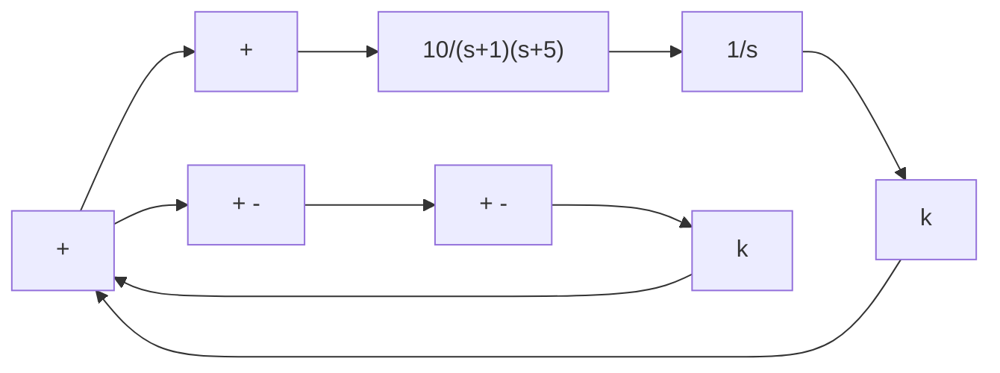
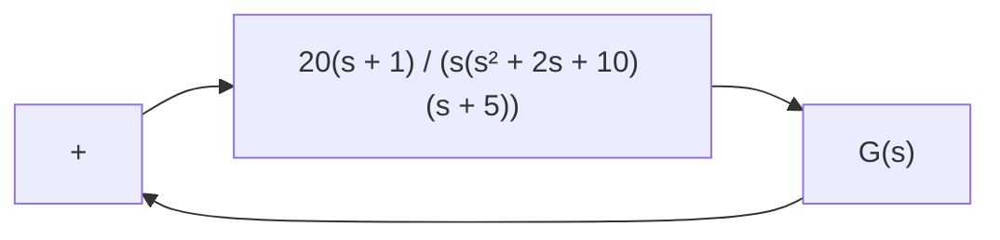

Figure 7–160   
Control system.

B–7–21. Consider the system defined by

$$
\left[ \begin{array}{c} \dot {x} _ {1} \\ \dot {x} _ {2} \end{array} \right] = \left[ \begin{array}{c c} - 1 & - 1 \\ 6. 5 & 0 \end{array} \right] \left[ \begin{array}{c} x _ {1} \\ x _ {2} \end{array} \right] + \left[ \begin{array}{c c} 1 & 1 \\ 1 & 0 \end{array} \right] \left[ \begin{array}{c} u _ {1} \\ u _ {2} \end{array} \right]

\left[ \begin{array}{c} y _ {1} \\ y _ {2} \end{array} \right] = \left[ \begin{array}{c c} 1 & 0 \\ 0 & 1 \end{array} \right] \left[ \begin{array}{c} x _ {1} \\ x _ {2} \end{array} \right] + \left[ \begin{array}{c c} 0 & 0 \\ 0 & 0 \end{array} \right] \left[ \begin{array}{c} u _ {1} \\ u _ {2} \end{array} \right]
$$

There are four individual Nyquist plots involved in this system. Draw two Nyquist plots for the input $u _ { 1 }$ in one diagram and two Nyquist plots for the input $u _ { 2 }$ in another diagram. Write a MATLAB program to obtain these two diagrams.

B–7–25. Consider the system shown in Figure 7–162. Draw a Bode diagram of the open-loop transfer function $G ( s )$ . Determine the phase margin and gain margin with MATLAB.

flowchart

Figure 7–162   
Control system.

B–7–26. Consider a unity-feedback control system with the open-loop transfer function

$$G (s) = \frac {K}{s \left(s ^ {2} + s + 4\right)}$$

Determine the value of the gain K such that the phase margin is 50°. What is the gain margin with this gain K?

B–7–27. Consider the system shown in Figure 7–163. Draw a Bode diagram of the open-loop transfer function, and determine the value of the gain K such that the phase margin is 50°. What is the gain margin of this system with this gain K?

```mermaid
graph LR
    A["+"] --> B["K (s + 0.1)/(s + 0.5)"]
    B --> C["(10)/(s(s+1))"]
    C --> D
    D --> E
    E --> F
    F --> G
    G --> H
    H --> I
    I --> J
    J --> K
    K --> L
    L --> M
    M --> N
    N --> O
    O --> P
    P --> Q
    Q --> R
    R --> S
    S --> T
    T --> U
    U --> V
    V --> W
    W --> X
    X --> Y
    Y --> Z
    Z --> A
```

flowchart

Figure 7–163 Control system.
