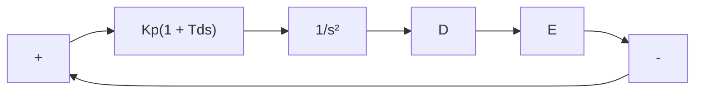

B–7–28. Consider a unity-feedback control system whose open-loop transfer function is

$$G (s) = \frac {K}{s \left(s ^ {2} + s + 0 . 5\right)}$$

Determine the value of the gain K such that the resonant peak magnitude in the frequency response is 2 dB, or $M _ { r } = 2 \mathop { } \mathrm { d } \mathrm { B } .$ .

B–7–29. A Bode diagram of the open-loop transfer function G(s) of a unity-feedback control system is shown in Figure 7–164. It is known that the open-loop transfer function is minimum phase. From the diagram, it can be seen that there is a pair of complex-conjugate poles at v=2 radsec. Determine the damping ratio of the quadratic term involving these complex-conjugate poles. Also, determine the transfer function G(s).

line

| ω in rad/sec | dB | Angle |
| --- | --- | --- |
| 0.1 | 40.0 | 0° |
| 0.2 | 30.0 | -180° |
| 0.4 | 20.0 | -90° |
| 0.6 | 15.0 | -180° |
| 1.0 | 10.0 | -270° |
| 2.0 | 15.0 | -270° |
| 4.0 | -20.0 | -270° |
| 6.0 | -40.0 | -270° |
| 10.0 | -60.0 | -270° |
| 20.0 | -80.0 | -270° |
| 40.0 | -90.0 | -270° |
| 60.0 | -95.0 | -270° |
| 100.0 | -100.0 | -270° |

Figure 7–164 Bode diagram of the open-loop transfer function of a unityfeedback control system.

B–7–30. Draw Bode diagrams of the PI controller given by

$$G _ {c} (s) = 5 \left(1 + \frac {1}{2 s}\right)$$

and the PD controller given by

$$G _ {c} (s) = 5 (1 + 0. 5 s)$$

B–7–31. Figure 7–165 shows a block diagram of a spacevehicle attitude-control system. Determine the proportional gain constant $K _ { p }$ and derivative time $T _ { d }$ such that the bandwidth of the closed-loop system is 0.4 to 0.5 radsec. (Note that the closed-loop bandwidth is close to the gain crossover frequency.) The system must have an adequate phase margin. Plot both the open-loop and closed-loop frequency response curves on Bode diagrams.

flowchart

Figure 7–165

Block diagram of space-vehicle attitude-control system.
