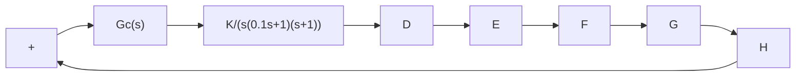
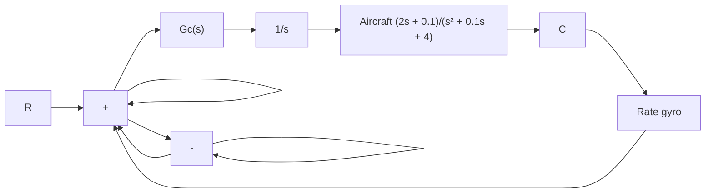
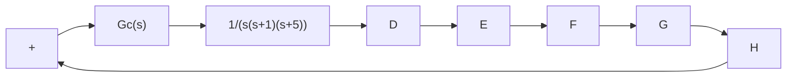

B–7–32. Referring to the closed-loop system shown in Figure 7–166, design a lead compensator $G _ { c } ( s )$ such that the phase margin is $4 5 ^ { \circ }$ , gain margin is not less than 8 dB, and the static velocity error constant $K _ { v }$ is $4 . 0 \ \mathrm { s e c } ^ { - 1 }$ . Plot unit-step and unit-ramp response curves of the compensated system with MATLAB.

flowchart

Figure 7–166

Closed-loop system.

B–7–33. Consider the system shown in Figure 7–167. It is desired to design a compensator such that the static velocity error constant is 4 sec–1, phase margin is $5 0 ^ { \circ }$ , and gain margin is 8 dB or more. Plot the unit-step and unitramp response curves of the compensated system with MATLAB.

flowchart

Figure 7–167

Control system.

B–7–34. Consider the system shown in Figure 7–168. Design a lag–lead compensator such that the static velocity error constant $K _ { v }$ is 20 sec–1, phase margin is $6 0 ^ { \circ }$ , and gain margin is not less than 8 dB. Plot the unit-step and unitramp response curves of the compensated system with MATLAB.

flowchart

Figure 7–168

Control system.

text_image

8

