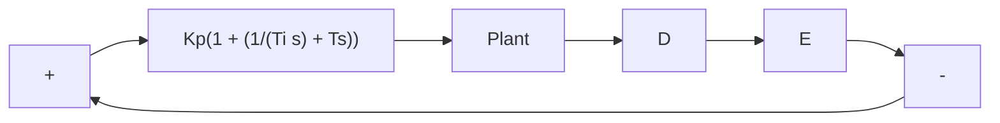

# 8–2 ZIEGLER–NICHOLS RULES FOR TUNINGPID CONTROLLERS

PID Control of Plants. Figure 8–1 shows a PID control of a plant. If a mathematical model of the plant can be derived, then it is possible to apply various design techniques for determining parameters of the controller that will meet the transient and steady-state specifications of the closed-loop system. However, if the plant is so complicated that its mathematical model cannot be easily obtained, then an analytical or computational approach to the design of a PID controller is not possible.Then we must resort to experimental approaches to the tuning of PID controllers.

The process of selecting the controller parameters to meet given performance specifications is known as controller tuning. Ziegler and Nichols suggested rules for tuning PID controllers (meaning to set values $K _ { p } , T _ { i }$ and, $T _ { d } )$ based on experimental step responses or based on the value of $K _ { p }$ that results in marginal stability when only proportional control action is used. Ziegler–Nichols rules, which are briefly presented in the following, are useful when mathematical models of plants are not known. (These rules can, of course, be applied to the design of systems with known mathematical models.) Such rules suggest a set of values of $K _ { p } , T _ { i }$ and, $T _ { d }$ that will give a stable operation of the system. However, the resulting system may exhibit a large maximum overshoot in the step response, which is unacceptable. In such a case we need series of fine tunings until an acceptable result is obtained. In fact, the Ziegler–Nichols tuning rules give an educated guess for the parameter values and provide a starting point for fine tuning, rather than giving the final settings for $K _ { p } , T _ { i }$ and, $T _ { d }$ in a single shot.

Figure 8–1 PID control of a plant.   

flowchart

