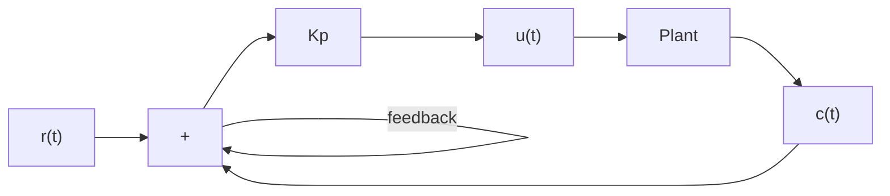

$$\frac {C (s)}{U (s)} = \frac {K e ^ {- L s}}{T s + 1}$$

Ziegler and Nichols suggested to set the values of $K _ { p } , T _ { i }$ and, $T _ { d }$ according to the formula shown in Table 8–1.

Notice that the PID controller tuned by the first method of Ziegler–Nichols rules gives

$$
\begin{array}{l} G _ {c} (s) = K _ {p} \left(1 + \frac {1}{T _ {i} s} + T _ {d} s\right) \\ = 1. 2 \frac {T}{L} \left(1 + \frac {1}{2 L s} + 0. 5 L s\right) \\ = 0. 6 T \frac {\left(s + \frac {1}{L}\right) ^ {2}}{s} \\ \end{array}
$$

Thus, the PID controller has a pole at the origin and double zeros at $s = - 1 / L$ .

Second Method. In the second method, we first set $T _ { i } = \infty$ and $T _ { d } = 0$ Using the. proportional control action only (see Figure 8–4), increase $K _ { p }$ from 0 to a critical value $K _ { \mathrm { c r } }$ at which the output first exhibits sustained oscillations. (If the output does not exhibit sustained oscillations for whatever value $K _ { p }$ may take, then this method does not apply.) Thus, the critical gain $K _ { \mathrm { c r } }$ and the corresponding period $P _ { \mathrm { c r } }$ are experimentally determined (see Figure 8–5). Ziegler and Nichols suggested that we set the values of the parameters $K _ { p } , T _ { i }$ and, $T _ { d }$ according to the formula shown in Table 8–2.

Figure 8–4 Closed-loop system with a proportional controller.   

flowchart

Figure 8–5 Sustained oscillation with period $P _ { \mathrm { c r } } .$ $( \boldsymbol { P } _ { \mathrm { c r } }$ is measured in sec.)   

line

| t | c(t) |
| --- | --- |
| 0 | 0 |
| Peak | High |
| Cr | Low |

Table 8–2 Ziegler–Nichols Tuning Rule Based on Critical Gain $K _ { \mathrm { c r } }$ and Critical Period $P _ { \mathrm { c r } }$ (Second Method)
