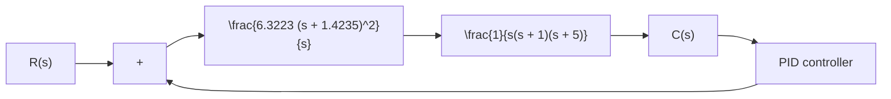

from which we find the frequency of the sustained oscillation to be $\omega ^ { 2 } = 5 \mathrm { o r } \omega = \sqrt { 5 }$ Hence, the. period of sustained oscillation is

$$P _ {\mathrm{cr}} = \frac {2 \pi}{\omega} = \frac {2 \pi}{\sqrt {5}} = 2. 8 0 9 9$$

Referring to Table 8–2, we determine $K _ { p } , T _ { i } $ and, $T _ { d }$ as follows:

$$K _ {p} = 0. 6 K _ {\mathrm{cr}} = 1 8T _ {i} = 0. 5 P _ {\mathrm{cr}} = 1. 4 0 5T _ {d} = 0. 1 2 5 P _ {\mathrm{cr}} = 0. 3 5 1 2 4$$

The transfer function of the PID controller is thus

$$
\begin{array}{l} G _ {c} (s) = K _ {p} \left(1 + \frac {1}{T _ {i} s} + T _ {d} s\right) \\ = 1 8 \left(1 + \frac {1}{1 . 4 0 5 s} + 0. 3 5 1 2 4 s\right) \\ = \frac {6 . 3 2 2 3 (s + 1 . 4 2 3 5) ^ {2}}{s} \\ \end{array}
$$

The PID controller has a pole at the origin and double zero at $s = - 1 . 4 2 3 5 . \mathrm { A }$ block diagram of the control system with the designed PID controller is shown in Figure 8–7.

Figure 8–7

Block diagram of the system with PID controller designed by use of the Ziegler–Nichols tuning rule (second method).

flowchart

Next, let us examine the unit-step response of the system. The closed-loop transfer function $C ( s ) / R ( s )$ is given by

$$\frac {C (s)}{R (s)} = \frac {6 . 3 2 2 3 s ^ {2} + 1 8 s + 1 2 . 8 1 1}{s ^ {4} + 6 s ^ {3} + 1 1 . 3 2 2 3 s ^ {2} + 1 8 s + 1 2 . 8 1 1}$$

The unit-step response of this system can be obtained easily with MATLAB. See MATLAB Program 8–1. The resulting unit-step response curve is shown in Figure 8–8. The maximum overshoot in the unit-step response is approximately 62%.The amount of maximum overshoot is excessive. It can be reduced by fine tuning the controller parameters. Such fine tuning can be made on the computer. We find that by keeping $K _ { p } = 1 8$ and by moving the double zero of the PID controller to s=–0.65—that is, using the PID controller

$$G _ {c} (s) = 1 8 \left(1 + \frac {1}{3 . 0 7 7 s} + 0. 7 6 9 2 s\right) = 1 3. 8 4 6 \frac {(s + 0 . 6 5) ^ {2}}{s} \tag {8-1}$$

the maximum overshoot in the unit-step response can be reduced to approximately 18% (see Figure 8–9). If the proportional gain $K _ { p }$ is increased to 39.42, without changing the location of the double zero (s=–0.65), that is, using the PID controller

$$G _ {c} (s) = 3 9. 4 2 \left(1 + \frac {1}{3 . 0 7 7 s} + 0. 7 6 9 2 s\right) = 3 0. 3 2 2 \frac {(s + 0 . 6 5) ^ {2}}{s} \tag {8-2}$$
